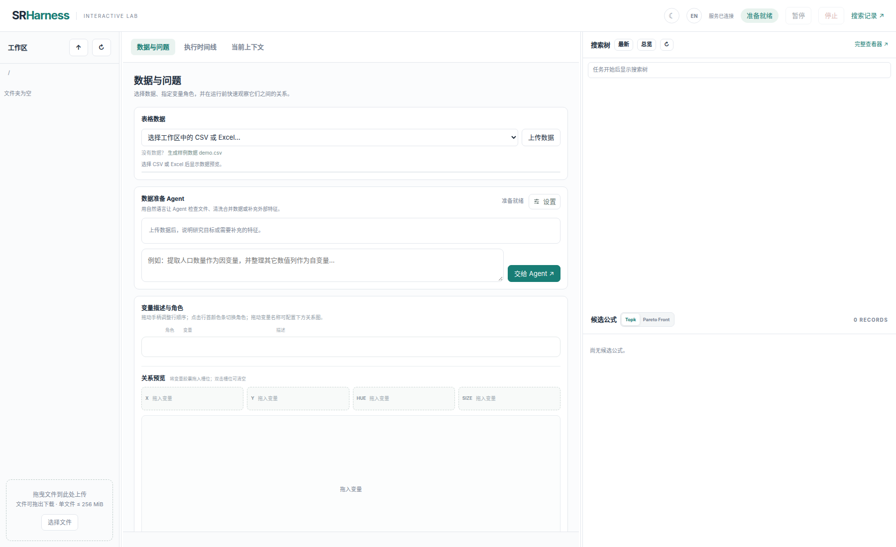
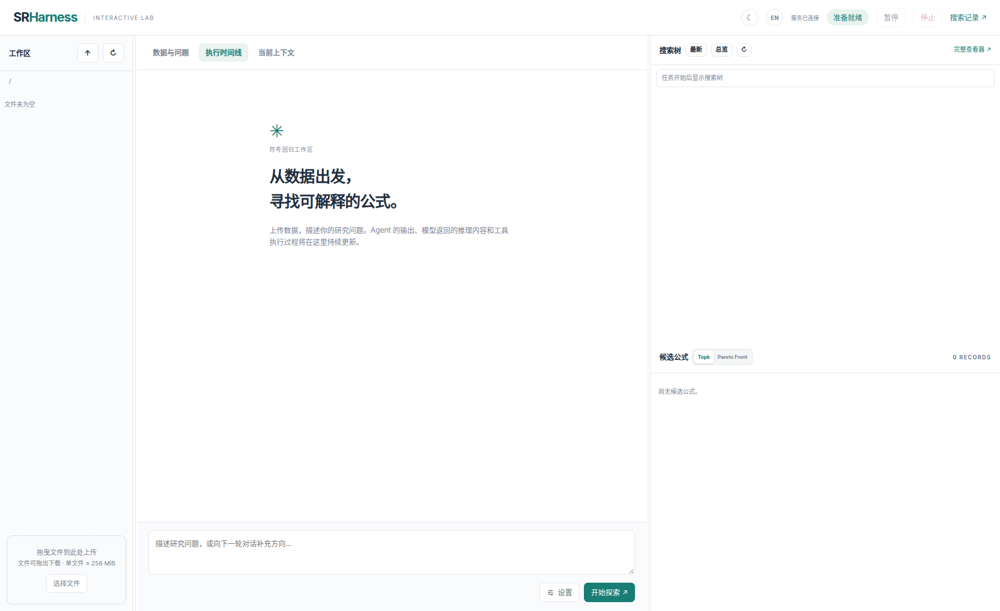

# SRHarness：面向智能体符号回归的 Harness

[English](README.md) | [简体中文](README.zh.md) | [SRHarness 完整文档](docs/index.md) | [SRHarness-Engine 文档](docs/engine.md)

SRHarness 是一个面向**智能体符号回归（agentic symbolic regression）**的领域专用运行时。它支持大语言模型分析数值观测、选择科学操作、评估相互竞争的假设，并在长搜索轨迹中逐步改进符号公式。

> **研究代码说明：** 项目仍在持续开发。完整实验可能产生大量付费 LLM 请求，也可能调用外部求解器。建议先使用较小的 `R-C-L-K` 配置，并检查生成的日志，再启动大规模 Benchmark。

## 为什么使用 SRHarness？

SRHarness 围绕三项机制组织智能体方程发现过程：

- **可组合的科学动作。** 数据分析、拟合、评估与搜索工具使用统一接口。动作不仅可以处理原始变量，也可以处理变量变换、残差及其它由候选公式派生的视图。
- **持久化科学状态。** 候选公式、数值指标、复杂度、证据和来源信息不会随单次对话结束而丢失。系统通过紧凑的 Pareto 与 Top-candidate 视图将有用状态重新呈现给模型。
- **搜索轨迹生命周期管理。** 可配置的 `R-C-L-K` 调度器协调重启、独立分支、逐步改进和局部响应采样，同时保留有用的中间结果。

内置科学动作覆盖统计与关系分析、公式/代码评估、常数及结构化拟合、PySR 和 SINDy、代码执行、技能管理与最终公式提交。用户可以启用、禁用或扩展工具，而不必修改 Agent 主循环。

## 主要实验结果

论文在 LLM-SRBench 上评估了 SRHarness，包括 LSR-Synth、LSR-Transform，以及去除科学描述和变量语义的匿名 LSR-Transform。

| 方法 / 基础模型 | LSR-Transform SA | LSR-Transform-Anon SA |
|---|---:|---:|
| SRHarness + DeepSeek-v4-flash-0731 | **93.69%** | **72.97%** |
| SR-Scientist + DeepSeek-v4-flash-0731 | 62.16% | 39.64% |
| Codex + DeepSeek-v4-flash-0731 | — | 20.72% |

以上为论文中的符号准确率。完整的数值、符号、复杂度、资源消耗与消融结果，以及准确的评测协议，请参见论文。

## 安装

### 环境要求

- 主要测试平台为 Linux。
- 需要 Python **3.12 或更高版本**。
- 建议安装 Git 和可用的 C/C++ 编译工具链。
- 部分可选动作有额外依赖，例如 PySR 需要 Julia，神经网络组件需要 PyTorch。

以下流程与 [`scripts/install.sh`](scripts/install.sh) 一致，但使用 HTTPS 地址：

```bash
git clone https://github.com/yuzhTHU/MySRAgent.git SRHarness
cd SRHarness

conda create -p ./venv python=3.12 -y
conda activate ./venv

# 核心包及开发/测试依赖。
pip install -e ".[dev]"
```

按需安装可选组件：

```bash
pip install -e ".[web]"       # Web 搜索树查看器
pip install -e ".[tools]"     # PySR、gplearn、PySINDy 和 PDF 文本提取
pip install -e ".[nn]"        # 实验性神经网络组件
pip install -e ".[all]"       # 安装以上全部组件
```

## 配置模型服务

首次使用时复制仓库中的环境变量模板，然后只填写实际使用的服务：

```bash
test -f .env || cp .env.sample .env
```

例如，使用 OpenRouter 时至少需要：

```dotenv
OPENROUTER_API_KEY="sk-or-v1-..."
```

代码还包含 DeepSeek、Gemini、OpenAI/Azure OpenAI、SiliconFlow、LM Studio 及手动交互适配器。对应变量参见 [`.env.sample`](.env.sample)。不要提交 `.env`；该文件已被 Git 忽略。

## 快速开始

运行一个小型合成问题：

```bash
conda activate ./venv

sr-harness synthetic \
  --equation "y = sin(x1 - x2)" \
  --x_low -10 \
  --x_high 10 \
  --llm_provider openrouter \
  --llm_model deepseek/deepseek-v4-flash-0731 \
  --force_initial_diagnostics \
  -R 1 -C 1 -L 3 -K 1
```

该命令会产生付费 API 请求。搜索预算由以下参数控制：

| 符号 | 含义 |
|---|---|
| `R` | 基于持久化历史候选启动的重启轮数 |
| `C` | 每轮重启中的独立对话分支数 |
| `L` | 每个分支的改进步数 |
| `K` | 每一步中局部采样的模型响应数 |

模型响应的名义数量约为 `R × C × L × K`；重试及服务商行为可能改变实际用量。

### Python API

```python
import numpy as np
from sr_harness import SRAgent

x1 = np.linspace(-3.0, 3.0, 100)
x2 = np.linspace(3.0, -3.0, 100)

agent = SRAgent(
    llm_provider="openrouter",
    llm_model="deepseek/deepseek-v4-flash-0731",
    max_restart_loop=1,
    global_width=1,
    max_refinement_depth=3,
    local_sample_size=1,
    save_path="logs/python_api_demo",
)

result = agent.run(
    X={"x1": x1, "x2": x2},
    y={"y": np.sin(x1 - x2)},
    problem_description="Discover y as a function of x1 and x2.",
)
best = result["candidates"][result["best_candidate"]]
print(best["formula"])
```

## LLM-SRBench 评测

下载 Benchmark 数据；该步骤可能需要 Git LFS：

```bash
git lfs install
git clone https://huggingface.co/datasets/nnheui/llm-srbench \
  ./data/llm-srbench-data
```

建议先运行一个 LSR-Transform 问题：

```bash
sr-harness benchmark \
  --algorithm sr_harness \
  --datasets lsrtransform \
  --problem_names II.6.15b_1_0 \
  --exp_name smoke_lsrtransform \
  --llm_provider openrouter \
  --llm_model deepseek/deepseek-v4-flash-0731 \
  -R 1 -C 1 -L 3 -K 1
```

添加 `--anonymize` 后，变量名和科学描述会被替换为通用输入/输出标签，数值观测保持不变：

```bash
sr-harness benchmark \
  --algorithm sr_harness \
  --datasets lsrtransform \
  --problem_names II.6.15b_1_0 \
  --exp_name smoke_lsrtransform_anon \
  --anonymize \
  --llm_provider openrouter \
  --llm_model deepseek/deepseek-v4-flash-0731 \
  -R 1 -C 1 -L 3 -K 1
```

Benchmark 入口还包含传统方法和其它 LLM 方法的适配器；`sr-harness benchmark --help` 会列出通用参数，各适配器则定义相应方法的专用参数。复现论文规模的实验需要使用对应实验记录中的准确模型、工具集、数据划分、token 上限、随机种子和 `R-C-L-K` 设置；以上 smoke test 有意使用较小预算。

## 日志与 Web 可视化

`SearchRunState` 始终在内存中维护当前运行。启用 `save_path` 后，它还会写入：

- `run.json`：全局唯一的运行 ID 与 Agent 元数据；
- `nodes.jsonl`：搜索节点、父子关系、Prompt、动作、结果和用量；
- `result.json`：候选公式，以及 Pareto front 和最佳候选的下标；
- `response.jsonl`：原始模型响应与 token/费用统计；
- `tool_calls.jsonl`：工具调用及输出；
- 文本日志与相应入口生成的结果文件。

当 `save_path=None` 时，运行标识、父子关系、候选公式和最终结果仍可通过
`agent.run_state` 完整访问，同时不会创建搜索状态文件。

安装并启动 Web 查看器：

```bash
pip install -e ".[web]"
sr-harness run --save-dir logs/run --host 127.0.0.1 --port 8000
```

默认使用临时工作区。如需保留工作区并使用已有资料，可以指定工作区目录，并将多个文件或目录只读挂载到其根目录：

```bash
sr-harness run --workspace ./workspace --mount ./data.csv ./papers --port 8000
```

挂载输入的 basename 必须唯一。数据准备 Agent 和预览接口可以读取这些内容，但上传接口与
工作区工具不能修改其源文件。已存在于指定工作区中的文件可被 AI 工具修改或删除；
当该目录非空时，CLI 会显示警告。

随后打开 <http://127.0.0.1:8000/>。Web API 与搜索查看器直接读取当前会话内存中的
`SearchRunState`，不依赖持久化运行文件。





工作台默认打开“数据准备”页，用于上传文件、生成样例数据和与数据准备 Agent 交互。
“数据分析”页用于选择 CSV 或 Excel，指定一个因变量和若干自变量，编辑变量描述，并将变量拖入
X/Y/Hue/Size 槽位以快速预览变量关系。SRHarness 会根据这些
配置生成初始 System Prompt 和 User Prompt，两者均可在运行前编辑。内置 `demo.csv`
包含三个输入列（其中一个是分类变量）和一个数值因变量。

运行期间，“执行时间线”展示模型推理、工具调用及结果、token/费用用量和控制事件；
“当前上下文”展示各个 R-C-L 节点对应的消息。搜索树与候选公式面板会联动到相应节点，
候选公式可在全部排名结果和 Pareto front 之间切换。研究者指导、模型修改、暂停/继续、
停止以及 `ask_human` 回复会在安全的操作边界生效。界面支持中英文、明暗主题，以及可调整
宽度或折叠的左右面板。

### 研究后端、Subagent 与双向交互

默认工具集现包含逐子树递归诊断的 `evaluate_eic`、直接运行 MDLformer-guided 搜索的
`sr4mdl`、直接运行 NDformer-guided 网络动力学搜索的 `nd2`，以及面向符号回归假设生成/候选审查/残差诊断/搜索恢复的
`delegate_subagent`，以及 `web_search` 和 `read_pdf`。SR4MDL 与 ND2 分别通过
`SR4MDL_HOME`、`ND2_HOME` 配置，也会自动发现 `third-party/SR4MDL` 和
`third-party/ND2`；预训练权重分别由 `SR4MDL_CHECKPOINT` 与 `ND2_CHECKPOINT` 指定。
启用 `evaluate_eic` 后，新产生的普通标量候选会自动接受轻量结构审查，诊断结果会保留在候选状态中。
三项研究工具的说明由各自 `get_doc()` 动态注册为
只读 runtime skill，不在内置 `skills/` 目录维护副本。

`SRAgentInteractive` 通过 `InteractionManager` 连接具体交互界面，同时继续使用统一的搜索
循环。默认的 `TerminalInteractionManager` 在终端中处理 `ask_human`；Web 工作台则注入
`WebInteractionManager`，负责将运行状态和工作区绑定到 Web Session，在安全边界处理暂停、
恢复、停止和研究者意见，并发布模型、工具与候选事件。界面适配器不持有科研搜索状态，
也不复制 R-C-L 循环。

auto-routing 用于模型后端选择：简单任务和早期探索使用基础后端；配置了
`strong_llm_provider` / `strong_llm_model` 后，复杂任务或两轮仍未收敛的搜索会升级到
强后端。设置 `auto_routing=False` 后所有请求固定使用基础后端。Skill 的创建、读取和
编辑仍完全使用 SRAgent 自身的 `create_skill` / `read_skill` / `edit_skill` 协议。

## 评测与可复现性说明

- 搜索和候选选择期间不会向 Agent 暴露 Benchmark 测试数据。
- 可通过 `--validation_fraction` 和 `--split_by` 从可见训练数据中划分随机或 OOD 风格的验证集。
- 数值预测使用统一 Benchmark pipeline 评估；符号等价评估实现在 [`src/sr_harness/utils/symbolic_acc.py`](src/sr_harness/utils/symbolic_acc.py)。
- 日志保留 Prompt、模型响应、工具调用、候选来源、token 用量和记录到的费用，便于完成后审计运行过程。
- API 行为、模型别名、价格和随机输出可能随时间变化。严肃比较时应记录准确的 provider/model 标识、代码版本、参数和运行环境。

## 扩展 SRHarness

新的科学动作需要继承 `BaseTool`、声明稳定的元数据，并返回可序列化结果。产生候选公式的动作应复用统一评估契约，使公式、训练/验证指标、复杂度、诊断和来源信息能够一致地进入持久化科学状态。

进一步说明见：

- [`src/sr_harness/README.md`](src/sr_harness/README.md)：Agent 循环与内部架构；
- [`src/sr_harness/tools/README.md`](src/sr_harness/tools/README.md)：科学动作 API 与自定义工具指南；
- [`tests/README.md`](tests/README.md)：测试约定。

## 项目结构

```text
├── src/sr_harness/          # Python 包
│   ├── agents/              # 批处理与交互式 SRAgent
│   ├── api/                 # BaseAPI 与 LLM 服务适配器
│   ├── core/                # API、工具、候选、节点与运行状态结构
│   ├── interaction/         # 终端与 Web 交互管理器
│   ├── runtime/             # 模型路由与交互控制
│   ├── cli/                 # sr-harness 子命令
│   ├── parser/              # 原生/text/JSON/XML 工具调用解析
│   ├── tools/               # 科学动作及统一评估契约
│   ├── skills/              # 可复用的 Agent 科学指导文档
│   ├── web/                 # 交互工作台后端与静态界面
│   ├── utils/               # 指标、符号准确率、日志及其它工具
│   └── _vendor/             # 集成的 Benchmark/基线适配器
├── tests/                   # 单元测试与集成测试
├── scripts/                 # 实验及分析脚本
├── analysis/                # 分析 notebook
├── data/                    # 本地数据，已被 Git 忽略
├── logs/                    # 运行资产，已被 Git 忽略
└── playground/              # 临时实验，已被 Git 忽略
```

目录约定：

- 面向用户的命令统一作为 `sr-harness` 子命令放在 `src/sr_harness/cli/` 下。
- 实验与分析工具放在 `scripts/`。
- 分析 notebook 使用 `YYMMDD_description.ipynb` 命名，并避免提交大体积输出。
- `data/`、`logs/` 和 `playground/` 作为本地工作目录使用。

## 测试

默认测试配置会排除标记为 `slow` 或 `paid` 的测试：

```bash
python -m pytest tests/ -v
```

只有在相关服务和预算可用时，才应运行付费或慢速集成测试。

## 许可证

SRHarness 使用 [MIT License](LICENSE) 开源。
