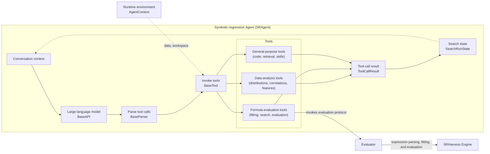
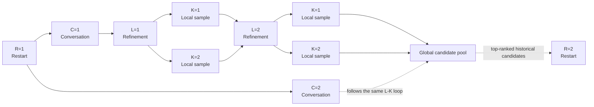
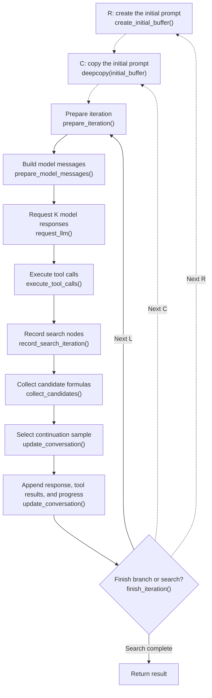

# SRHarness Agent Workflow

This page explains how the symbolic-regression Agent `SRAgent` organizes models, tools, and search state in SRHarness.

## Core components

SRHarness extracts statistical calculations, parameter fitting, and other tasks that are ill-suited to language models into tools. The language model uses those tools to analyze data and propose candidate models, while the SRHarness runtime connects the two sides: it translates model intent into structured tool calls, executes them, records evidence, and returns the results to the next model context. The principal components and workflow are shown below.

In this diagram:

- `SRAgent` owns the relevant component instances and drives the complete loop. It maintains the current conversation context, sends it to the model, and writes the new search state produced after tool execution back into subsequent turns.
- `BaseAPI` sends the conversation to a concrete language model while normalizing provider-specific requests, streaming output, and response formats.
- [`BaseParser`](core-abstractions.md#tool-call-parser) converts tool calls in model responses into one structured representation.
- [`BaseTool`](core-abstractions.md#base-tool) accepts tool calls in the prescribed format and provides common invocation, result storage, formatting, and error handling. SRHarness includes formula-evaluation tools that fit, search for, or evaluate candidate formulas; data-analysis tools that inspect distributions, correlations, and other properties; and general-purpose tools for code execution, information retrieval, and skill management.
- `AgentContext` provides the tool runtime environment, including data, the target variable, the Evaluator, control arguments, and the workspace, so the model does not need to repeatedly specify or generate this information for every call.
- `ToolCallResult` provides a uniform representation of the result produced by each tool execution.
- `SearchRunState` uses `ToolCallResult` objects to record search nodes, parent relationships, candidate formulas, and metrics, then exposes the Pareto front and remaining search budget as state for the next model turn.
- The [Evaluator](evaluator.md) provides data splitting, parameter fitting, metric computation, and related capabilities as a shared service for all formula-evaluation tools.
- [SRHarness Engine](engine.md) provides the Evaluator with underlying expression parsing, fitting, and evaluation capabilities.

## R-C-L-K search

R-C-L-K is the four-level coordinate system through which SRHarness controls restarts, search width, depth, and local sampling. Every model response corresponds to one specific `(R, C, L, K)` node in the search tree.

| Dimension | Parameter | Meaning |
|---|---|---|
| R | `max_restart_loop` | Number of restarts. Each new restart writes up to `restart_top_k` globally ranked historical candidates into a fresh initial prompt. |
| C | `global_width` | Independent conversation branches per restart. Branches share the restart seed information but maintain separate buffers. |
| L | `max_refinement_depth` | Maximum refinement steps per branch. Tool evidence and progress accumulate along the branch. |
| K | `local_sample_size` | Model responses requested for each refinement step. Every sample is executed and recorded before the primary continuation is selected by the candidate-ranking metric. |

Ignoring early termination, one search can generate at most `R × C × L × K` model responses. Setting `R=C=K=1` produces a clean, unbranched search record. In practice, however, allocating part of a fixed search budget to `R`, `C`, or `K` generally produces better results than spending the entire budget on increasing `L`.

`SearchRunState` records all `(R, C, L, K)` nodes as a search tree and aggregates candidate formulas across the entire tree, producing a global Pareto front and final best formula that cover every branch.

## Refinement-step execution

Each conversation branch begins with a system prompt, a user task, and current search progress. Every refinement step then follows this sequence:

In detail:

1. `create_initial_buffer()` creates the initial prompts at the start of each `R` from the system prompt, task description, current search progress, and best historical candidates. They form the common starting point for every conversation branch in the restart.
2. `deepcopy(initial_buffer)` copies the initial prompts at the start of each `C`, creating mutually independent branches that explore from the same starting point.
3. `prepare_iteration()` applies runtime changes before the turn, such as pausing execution, refreshing the tool environment, and accepting user messages.
4. `prepare_model_messages()` constructs the context messages sent to the model and adds optional initial diagnostics when `L=1`.
5. `request_llm()` requests `K` responses, each containing natural-language content and tool calls. When using the interactive `SRAgent` in the Web workspace, a response without tool calls triggers a pause and yields control until the user supplies additional information.
6. `execute_tool_calls()` executes each tool call and returns its corresponding `ToolCallResult`. Independent calls can be configured to run concurrently.
7. `record_search_iteration()` adds the generated `K` model responses and their tool-call results to the search tree.
8. `collect_candidates()` collects candidate formulas from tool-call results for global ranking, the Pareto front, and the final result.
9. `update_conversation()` selects the `K` sample that produced the best candidate as the primary context for the next turn. Results produced when other samples call data-analysis or general-purpose tools may also be incorporated into subsequent context.
10. `finish_iteration()` determines whether to end the current branch or the search.

A normal model response without tool calls is still valid. A non-interactive search may proceed to its next refinement step, while `SRAgentInteractive` naturally yields control until the user supplies more guidance.

## Tool-call lifecycle

A tool call is not a direct jump from a model response to a Python function. SRHarness organizes it as a standard execution pipeline so that tool declarations, call formats, error semantics, and result representations do not depend on a particular model provider or tool implementation.

```mermaid
flowchart LR
    A["Tool declaration<br/>BaseTool subclass"] --> B["Metadata construction<br/>description / parameter schema"]
    B --> C["Tool exposure<br/>BaseParser.format_tools()"]
    C --> D[Model response]
    D --> E["Call parsing<br/>BaseParser.parse_response()"]
    E --> F["Execution scheduling<br/>SRAgent.execute_tool_calls()"]
    F --> G["Uniform execution boundary<br/>BaseTool.__call__()"]
    G --> H["Tool implementation<br/>execute()"]
    H --> I["Result formatting<br/>format_result_dict()"]
    I --> J["Normalized result<br/>ToolCallResult"]
    G -. execution failure or interruption .-> J
    J --> K[Search recording and candidate collection]
    J --> L["Message conversion<br/>BaseParser.format_tool_result_messages()"]
    L --> M[Subsequent conversation context]
```

1. **Declaration and registration.** A tool is implemented as a `BaseTool` subclass and registered under a stable name. When the subclass is created, `BaseTool` completes missing descriptions and JSON parameter schemas from the `execute()` signature, type annotations, and Google-style docstring. Fields declared explicitly in `metadata` take precedence.
2. **Selection and exposure.** `SRAgent` instantiates the tools enabled for the current run. `BaseParser.format_tools()` renders declarations for the selected protocol, and `BaseAPI` submits them to the model service with the conversation messages. Registered tools that are not enabled are not exposed to the model.
3. **Response and call parsing.** `BaseParser.parse_response()` normalizes provider-native function calls, JSON calls, or text calls into `ToolCall`. Each call carries a tool name, parameters, and a call identifier. A model response without tool calls yields an empty list rather than a fabricated call.
4. **Scheduling.** `SRAgent.execute_tool_calls()` resolves each instance by tool name and supplies the model-generated parameters. When concurrency is configured, independent calls in the same batch may execute in parallel, while each still produces a separate result.
5. **Execution and normalization.** `BaseTool.__call__()` forms the uniform execution boundary: it checks cancellation, calls `execute(**parameters)`, measures elapsed time, and passes the structured return value to `format_result_dict()`. The resulting `ToolCallResult` retains both the complete machine-readable `result` and a length-bounded, model-facing `result_str`.
6. **Failure and interruption.** `BaseTool` does not impose one global timeout. Tools that invoke external processes or network services enforce limits appropriate to their operation. Timeout exceptions and other ordinary exceptions become `ok=False` `ToolCallResult` objects, while `ToolRunAbort`, which terminates higher-level control flow, continues to propagate. The interactive runtime can also use a cancellation signal to ask a long-running tool to stop promptly.
7. **Consumption.** Structured results are used to record search nodes, collect candidate formulas, and update global search state. `BaseParser.format_tool_result_messages()` converts the same results into messages required by the active model protocol and appends them to the subsequent conversation context. Machine-readable data therefore remains distinct from the textual representation consumed by the model.

See [SRHarness Core Abstractions](core-abstractions.md) for the extension contracts of tools, tool-call Parsers, and Evaluators.
