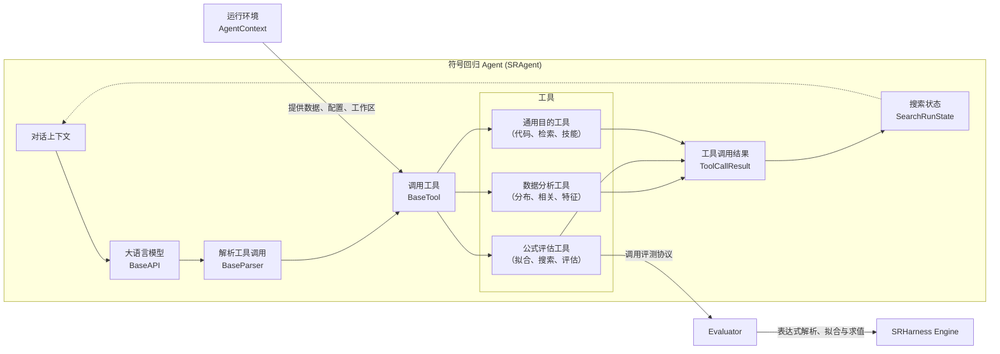
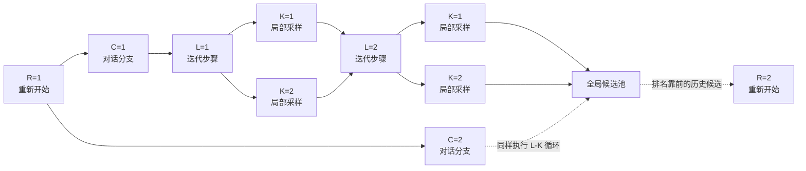
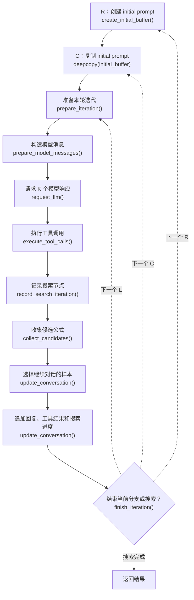
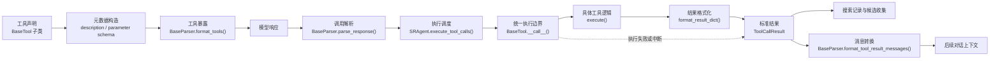

# SRHarness 智能体工作流

本页介绍 SRHarness 中，符号回归 Agent `SRAgent` 如何组织模型、工具和搜索状态。

## 核心组件

SRHarness 将统计计算、参数拟合等不适合语言模型完成的任务剥离为工具，让语言模型利用这些工具分析数据并提出候选模型。SRHarness 运行时则负责衔接两者，将语言模型的意图转换为结构化工具调用、执行工具、记录证据，并将结果送回下一轮模型上下文。主要组件和工作流如下图所示：

在这张图中：

- `SRAgent` 负责持有相关实例并驱动整个闭环。它能够维护当前对话上下文，将其交给模型，并把工具执行后形成的新搜索状态写回后续对话。
- `BaseAPI` 将对话发送给具体的大语言模型，并统一不同服务商的请求、流式输出和响应格式。
- [`BaseParser`](core-abstractions.md#tool-call-parser) 将模型响应中的工具调用转换为统一的结构化表示。
- [`BaseTool`](core-abstractions.md#base-tool) 接受指定格式的工具调用，并统一实现工具调用、结果保存、格式化与错误处理。SRHarness 提供了能够拟合、搜索或评估候选公式的公式评估工具，检查数据分布、相关性与其他特性的数据分析工具，以及执行代码、检索信息和管理技能的通用工具。
- `AgentContext` 提供工具的运行环境，包括数据、目标变量、评估器、控制参数和工作区，使得模型不必在每次调用时反复指定或生成这些信息。
- `ToolCallResult` 统一表示每次工具执行产生的结果。
- `SearchRunState` 利用 `ToolCallResult` 记录搜索节点、父关系、候选公式及其指标，并把帕累托前沿和剩余搜索预算组织为下一轮模型可见的搜索状态。
- [Evaluator](core-abstractions.md#evaluator) 提供数据切分、参数拟合、指标计算等功能，统一服务于所有公式评估工具。
- [SRHarness 符号引擎](engine.md) 为 Evaluator 提供表达式解析、拟合和求值等底层能力。

## R-C-L-K 搜索

R-C-L-K 是 SRHarness 控制搜索宽度、深度和重启的四层坐标。每次模型响应都对应搜索树中的一个特定 `(R, C, L, K)` 节点。

| 维度 | 参数 | 含义 |
|---|---|---|
| R | `max_restart_loop` | Restart 数。每个新 restart 根据全局候选排名，将至多 `restart_top_k` 个历史结果写入新的初始 prompt。 |
| C | `global_width` | 每个 restart 中相互独立的对话分支数。各分支从相同的 restart 初始信息出发，但维护独立 buffer。 |
| L | `max_refinement_depth` | 每个分支的最大 refinement step 数。工具结果和搜索进度会沿该分支逐轮积累。 |
| K | `local_sample_size` | 每个 refinement step 请求的模型响应数。所有样本都会被执行和记录，再根据候选排序指标选择主要延续样本。 |

若不考虑提前结束，一次搜索最多会生成 `R × C × L × K` 次模型响应。设置 `R=C=K=1` 将得到一条没有分叉的干净搜索记录，但根据经验，相比于将所有搜索预算放在增大 `L` 上，将一部分搜索预算分给 `R` / `C` / `K` 通常可以获得更好的结果。

`SearchRunState` 将所有 `(R, C, L, K)` 节点记录为一棵搜索树，并统计跨越整棵树的候选公式，以此记录覆盖了所有分支的全局帕累托前沿和最终最优公式。

## 单轮迭代的执行流程

每条对话分支从 system prompt、用户任务和当前搜索进度开始。随后每个 refinement step 按以下顺序执行：

具体而言：

1. `create_initial_buffer()` 在每个 `R` 开始时根据 system prompt、任务描述、当前搜索进度和历史最佳候选创建初始提示词，作为本次重启中所有对话分支的共同起点。
2. `deepcopy(initial_buffer)` 在每个 `C` 开始时复制初始提示词，以创建从相同起点开始的相互独立分支分别探索。
3. `prepare_iteration()` 应用本轮开始前的运行时变化，例如暂停运行、刷新工具环境、接受用户消息等等。
4. `prepare_model_messages()` 构造发送给模型的上下文消息，并在 `L=1` 时添加可选的初始诊断。
5. `request_llm()` 请求模型生成 `K` 个响应，每个响应包含自然语言内容和若干工具调用。若使用 Web 工作台中的交互式 `SRAgent`，不产生工具调用的响应将触发暂停并让出控制，等用户补充信息后再继续搜索。
6. `execute_tool_calls()` 执行各个工具调用并得到对应的 `ToolCallResult`。互不依赖的调用可被配置以并行执行。
7. `record_search_iteration()` 将生成的 `K` 个模型响应及其工具调用结果添加到搜索树。
8. `collect_candidates()` 从工具调用结果中收集候选公式以供全局排序、帕累托前沿和最终结果使用。
9. `update_conversation()` 选择一个产生最佳候选的 `K` 样本作为下一轮的主要上下文。其他样本调用数据分析工具或通用目的工具产生的结果也可被整合到后续上下文中。
10. `finish_iteration()` 判断是否结束当前分支或搜索。

如果模型给出了普通回复但没有调用任何工具，该回复仍是合法输出。非交互式搜索可以继续进入后续 refinement step；`SRAgentInteractive` 则会自然让出控制，等待用户补充消息后再继续。

## 工具调用生命周期

工具调用并不是一次从模型到 Python 函数的直接跳转。SRHarness 将其组织为一条标准执行链，使工具的声明方式、调用格式、错误语义和结果表示不依赖于具体模型服务或工具实现。

1. **工具声明与注册。** 工具以 `BaseTool` 子类的形式实现，并通过稳定名称注册。子类创建时，`BaseTool` 使用 `execute()` 的签名、类型标注和 Google-style docstring 补全缺失的工具说明与 JSON parameter schema；`metadata` 中已经显式声明的字段具有优先权。
2. **工具选择与暴露。** `SRAgent` 从注册表中实例化本次运行启用的工具。`BaseParser.format_tools()` 根据所选协议生成模型可接受的工具声明，`BaseAPI` 再将其与对话消息一并提交给模型服务。未启用的已注册工具不会暴露给模型。
3. **模型响应与调用解析。** `BaseParser.parse_response()` 将供应商原生 function call、JSON 调用或文本调用规范化为统一的 `ToolCall`。每个 `ToolCall` 包含工具名称、参数和调用标识；模型未调用工具时返回空列表，不会构造虚假的调用。
4. **调用调度。** `SRAgent.execute_tool_calls()` 按工具名称解析实例，并将模型生成的参数传入工具。配置并发执行后，同一批次中互不依赖的调用可以并行运行，但每次调用仍分别产生独立结果。
5. **工具执行与结果规范化。** `BaseTool.__call__()` 构成统一执行边界：它检查取消信号、调用 `execute(**parameters)`、记录执行时间，并将结构化返回值交给 `format_result_dict()`。最终的 `ToolCallResult` 同时保存完整的机器可读 `result` 和经过长度限制、供模型阅读的 `result_str`。
6. **失败与中断处理。** `BaseTool` 本身不施加统一超时；涉及外部进程或网络请求的工具负责实施适合自身的时间和资源限制。工具抛出的超时异常及其他普通异常会被转换为 `ok=False` 的 `ToolCallResult`，而用于终止更高层控制流程的 `ToolRunAbort` 会继续向上传播。交互式运行时还可以通过取消信号请求长时间运行的工具尽快停止。
7. **结果消费。** 结构化结果用于记录搜索节点、收集候选公式和更新全局搜索状态；`BaseParser.format_tool_result_messages()` 则将结果转换为当前模型协议要求的消息，并追加到后续对话上下文。由此，程序消费的结构化数据与模型读取的文本表示始终保持分离。

工具、工具调用 Parser 和 Evaluator 各自必须遵守的扩展接口见 [SRHarness 核心抽象](core-abstractions.md)。
