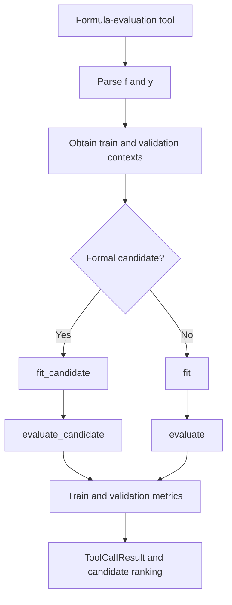

# SRHarness Core Abstractions

This page defines the contracts of three principal SRHarness extension interfaces. `BaseTool` specifies how tools declare inputs and return results, `BaseParser` normalizes calls between language models and tools, and `Evaluator` defines the data-splitting, parameter-fitting, and metric-computation policy shared by formula-evaluation tools. They live in separate source packages, but together form the stable boundary between `SRAgent` and extensible implementations.

See [SRHarness Agent Workflow](agent.md) for how the Agent coordinates these objects during a search, and the [API Reference](https://yuzhthu.github.io/SRHarness/reference/) for complete class and method signatures.

## `BaseTool` { #base-tool }

Every callable tool derives from `BaseTool`. A tool normally needs only metadata and an `execute()` implementation; the base class supplies the common behavior.

```python
from typing import Any

from sr_harness.tools import BaseTool, ToolMetadata


@BaseTool.register("example_tool")
class ExampleTool(BaseTool):
    metadata = ToolMetadata(name="example_tool")

    def execute(self, expression: str, limit: int = 10) -> dict[str, Any]:
        """Inspect an expression.

        Args:
            expression: Expression supplied by the model.
            limit: Maximum number of returned items.

        Returns:
            Structured inspection results.
        """
        parsed = self.parse_formula(expression)
        return {"expression": parsed.to_str(), "limit": limit}
```

### Input contract

- Arguments to `execute()` are generated by the model, so they should remain simple, serializable, and fully type-annotated.
- Data, Evaluators, workspace access, and runtime parameters belong in `self.context`; the model should not repeat a complex execution environment in every call.
- A tool may explicitly declare `metadata.description` and its JSON parameter schema. Otherwise, `BaseTool` infers them from the `execute()` signature, type annotations, and Google-style docstring.
- Tool classes are discovered by name through a registry, but the Agent exposes only the tools enabled for the current run.

### Result and error contract

- `execute()` returns a structured `dict` for recording and downstream candidate processing.
- `format_result_dict()` converts that structure into concise model-readable text. A tool may override the formatter without changing the machine-readable result.
- `BaseTool.__call__()` measures execution and returns `ToolCallResult(ok, result, result_str, meta_data)`.
- Ordinary exceptions, including timeout exceptions raised inside a tool, become `ok=False` tool results so that the model can inspect the failure and recover. The control-flow-specific `ToolRunAbort` is not swallowed as an ordinary failure.
- `result_str` is bounded in length, while `result` retains the complete structured value to prevent unbounded model-context growth.
- `cancel()` is an optional active-cancellation hook. Long-running tools should also inspect the runtime cancellation signal at suitable boundaries.

Formula-oriented tools can additionally reuse `BaseTool` helpers for formula normalization, parsing, evaluation, and result formatting instead of reimplementing the same boundary logic.

## Tool-call Parser { #tool-call-parser }

Here, Parser means a *tool-call Parser*, not a mathematical-expression Parser. Model APIs may represent tool calls through native function calling, JSON, or text, while the Agent loop handles only normalized `ToolCall` and `ToolCallResult` objects.

`BaseParser` defines three transformations:

1. format tool names, descriptions, and parameter schemas for the model;
2. parse model output into zero or more normalized `ToolCall` objects;
3. format `ToolCallResult` objects as messages for the next turn.

In `openai` mode, services with native function calling receive JSON schemas directly, and `BaseAPI` normalizes provider-native calls into `ToolCall`. For endpoints without native tool support, the `text` or `json` Parser writes tool descriptions and call syntax into the prompt and recovers structured calls from model text. Tool execution, search recording, and candidate collection therefore use the same internal structures regardless of the input format.

When the model emits no parseable tool call, the Parser returns an empty list rather than inventing a call or treating ordinary prose as an error. Mathematical expressions are handled separately by the restricted expression Parser in [SRHarness Engine](engine.md): one determines *which tool to call with which parameters*, while the other determines *what a formula means*.

## Evaluator { #evaluator }

An Evaluator is the shared evaluation protocol used by formula-evaluation tools in SRHarness. It encapsulates how data is split, how expression parameters are fitted, and which numeric metrics are used to evaluate the fitted expression. Tools such as `evaluate_formula`, `submit_formula`, polynomial fitting, and symbolic-search backends can therefore share one evaluation policy.

The active instance is stored in `AgentContext.evaluator`. SRHarness provides `DefaultEvaluator` for ordinary aligned data and `GraphEvaluator` for graph and hypergraph data. A user-defined Evaluator can inherit `DefaultEvaluator` and override only the behavior required by the task.

!!! info "The role of SRHarness Engine"
    Evaluators use the [SRHarness Engine](engine.md) `Expression` representation together with its parsing, parameter-fitting, and numerical-evaluation capabilities. The Engine does not decide data splits, candidate eligibility, metric definitions, or ranking policy; those belong to Evaluators and formula-evaluation tools. Keeping mathematical-expression infrastructure in the Engine lets tools and custom Evaluators share one mathematical semantics.

### Evaluation path

A formula tool first parses model-provided text into an [SRHarness Engine](engine.md) `Expression`. `BaseTool.evaluate()` then determines whether the formula is a formal candidate:

- when the left-hand expression is exactly `context.target` and the right-hand side does not depend on the target, it is a candidate and uses `fit_candidate()` and `evaluate_candidate()`;
- other equalities remain available for relationship exploration, but use the general `fit()` and `evaluate()` path and do not trigger candidate-only behavior.



The following pseudocode summarizes how formula tools use the five entry points:

```python
def evaluate_formula(f, y, context, evaluator):
    split = evaluator.split(context)
    train_context = split["train"]
    validation_context = split["validation"]
    is_candidate = (
        y.to_str() == context.target
        and context.target not in f.variables
    )

    fitted = (
        evaluator.fit_candidate(f, train_context)
        if is_candidate
        else evaluator.fit(f, y, train_context)
    )
    evaluate = (
        evaluator.evaluate_candidate
        if is_candidate
        else lambda expression, split_context: evaluator.evaluate(
            expression, y, split_context
        )
    )
    return {
        "train": evaluate(fitted, train_context),
        "validation": evaluate(fitted, validation_context),
    }
```

When fitting is requested, parameters are determined only on the training split. The same fitted expression is then evaluated on the training and validation splits. On first access, `AgentContext.train_split` or `AgentContext.validation_split` calls `evaluator.split(context)` and caches both context views until the data changes or the cache is explicitly invalidated.

Residual diagnostics, candidate eligibility, result formatting, and error wrapping remain responsibilities of `BaseTool`; individual Evaluators do not need to reimplement them.

### The `DefaultEvaluator` contract

`DefaultEvaluator` defines five class methods. A custom Evaluator may override any subset:

| Method | Input context | Responsibility |
|---|---|---|
| `split(context)` | Complete, unsplit context | Return exactly `{"train": AgentContext, "validation": AgentContext}`. |
| `fit(f, y, context)` | Training context | Fit parameters in `f` to approximate expression `y`, then return an `Expression` with bound parameters. |
| `evaluate(f, y, context)` | Training or validation context | Evaluate a general equality `y = f` and return numeric metrics. |
| `fit_candidate(f, context)` | Training context | Fit a formal candidate; by default this delegates to `fit(f, Symbol(context.target), context)`. |
| `evaluate_candidate(f, context)` | Training or validation context | Evaluate a formal candidate; by default this delegates to `evaluate(f, Symbol(context.target), context)`. |

This layering preserves the Agent's ability to explore general equalities while giving formal candidates a task-specific extension point. For example, a dynamics Evaluator can integrate `dx_dt = f(x, t)` and calculate trajectory error only in `evaluate_candidate()` without trying to integrate every implicit equality used for analysis.

An Evaluator must obey these result contracts:

- `fit()` and `fit_candidate()` return `sr_harness_engine.Expression` objects with no unbound parameters at evaluation time;
- `evaluate()` and `evaluate_candidate()` return `dict[str, float | int]`; booleans, strings, arrays, and nested values are not valid metrics;
- metric names enter train and validation results unchanged, and any metric can be selected as the candidate-ranking key;
- `complexity`, like every other metric, is returned by the Evaluator rather than injected separately by the runtime.

### Built-in Evaluators

#### `DefaultEvaluator`

`DefaultEvaluator` assumes sample arrays in `context.data` are aligned along their first dimension. It supports random and OOD splitting, uses SRHarness Engine to fit expression parameters and evaluate predictions, and returns these metrics by default:

```text
mse, rmse, mae, mape, r2,
aic, bic, pearson_r, spearman_r, complexity
```

#### `GraphEvaluator`

`GraphEvaluator` derives from `DefaultEvaluator` and handles data composed of `(..., N)`, `(..., E)`, and `(..., H)` arrays plus graph or hypergraph relation tables. It passes `context.num_nodes` during fitting and evaluation and slices only sample-aligned dimensions, leaving shared edge and hyperedge tables intact.

### Evaluator utilities

Reusable metric, splitting, and dynamics infrastructure is available from:

```python
from sr_harness.evaluator import utils
```

It includes:

- `calc_MSE()`, `calc_RMSE()`, `calc_MAE()`, `calc_MAPE()`, and `calc_R2()`;
- AIC, BIC, Pearson/Spearman correlation, and expression complexity;
- random, OOD, and chronological data splitting;
- `integrate_ODE()` and `calc_trajectory_rollout_RMSE()`.

Keeping these reusable operations in `utils` makes custom Evaluators concise without expanding the Evaluator contract into a general infrastructure layer.

### Custom Evaluators

The safest extension pattern is to inherit `DefaultEvaluator` and override the narrowest entry point that needs to change. This Evaluator preserves every default behavior and adds trajectory rollout RMSE only for formal dynamics candidates:

```python
from . import utils
from .default_evaluator import DefaultEvaluator


class TrajectoryRolloutEvaluator(DefaultEvaluator):
    @classmethod
    def evaluate_candidate(cls, f, context):
        metrics = super().evaluate_candidate(f, context)
        metrics["rollout_rmse"] = utils.calc_trajectory_rollout_RMSE(
            f,
            context,
            time="t",
            state="x",
        )
        return metrics
```

Override `fit_candidate()` as well when the fitting objective itself should include rollout behavior. Override `fit()` or `evaluate()` only when both general equalities and formal candidates require a different base policy.

A custom source file must define exactly one `DefaultEvaluator` subclass. `load_custom_evaluator()` validates and loads the source, instantiates the class, and retains source/file provenance. The WebUI can save, load, and test scripts in `context.evaluator/`, while the Evaluator Construction Agent can create or repair them; see [SRHarness WebUI](web-ui.md#evaluator-configuration).

See the [API Reference](https://yuzhthu.github.io/SRHarness/reference/) for complete signatures and [SRHarness Engine](engine.md) for expression syntax, parameters, and graph evaluation rules.
