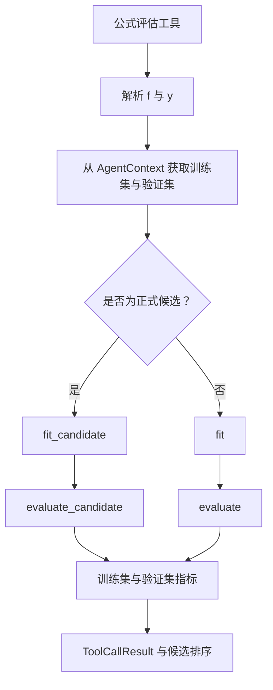

# SRHarness 核心抽象

本页说明 SRHarness 中三个主要扩展接口的合同：`BaseTool` 规定工具如何声明输入并返回结果，`BaseParser` 统一语言模型与工具之间的调用格式，`Evaluator` 定义公式评估工具共享的数据切分、参数拟合和指标计算方案。它们分别位于不同源码包中，但共同构成 `SRAgent` 与可扩展实现之间的稳定边界。

Agent 如何组织这些对象并驱动搜索，见 [SRHarness 智能体工作流](agent.md)；完整类和方法签名见 [API Reference](reference/index.md)。

## `BaseTool` { #base-tool }

所有可调用工具均继承 `BaseTool`。一个工具通常只需声明 `metadata` 并实现 `execute()`，其余公共行为由基类提供。

```python
from typing import Any

from sr_harness.tools import BaseTool, ToolMetadata


@BaseTool.register("example_tool")
class ExampleTool(BaseTool):
    metadata = ToolMetadata(name="example_tool")

    def execute(self, expression: str, limit: int = 10) -> dict[str, Any]:
        """Inspect an expression.

        Args:
            expression: Expression supplied by the model.
            limit: Maximum number of returned items.

        Returns:
            Structured inspection results.
        """
        parsed = self.parse_formula(expression)
        return {"expression": parsed.to_str(), "limit": limit}
```

### 输入合同

- `execute()` 的参数由模型生成，因此应保持简单、可序列化，并提供完整类型标注；
- 工具所需的数据、Evaluator、工作区或运行参数应通过 `self.context` 获取，不应要求模型重复传入复杂运行环境；
- `metadata.description` 和 JSON parameter schema 可以显式声明；省略时，`BaseTool` 会从 `execute()` 的签名、类型标注和 Google-style docstring 推断；
- 工具类通过注册表按名称发现，但 Agent 只向模型暴露本次运行启用的工具。

### 输出与错误合同

- `execute()` 返回结构化 `dict`，供程序记录和后续候选处理；
- `format_result_dict()` 将结构化结果转换为适合反馈给模型的文本，工具可以重载该方法而不改变机器可读结果；
- `BaseTool.__call__()` 统一测量执行时间，并返回 `ToolCallResult(ok, result, result_str, meta_data)`；
- 普通异常（包括工具内部产生的超时异常）会被包装为 `ok=False` 的工具结果，使模型可以读取错误并尝试修复；控制流程使用的 `ToolRunAbort` 不会被当作普通失败吞掉；
- `result_str` 有长度上限，而 `result` 保留完整结构化值，避免超长输出无界占用模型上下文；
- `cancel()` 是可选的主动取消入口；长时间运行的工具还应在合适位置检查运行时提供的取消信号。

公式类工具还可以复用 `BaseTool` 提供的公式规范化、解析、评估与结果格式化辅助方法，避免分别实现相同边界逻辑。

## 工具调用 Parser { #tool-call-parser }

这里的 Parser 指“工具调用 Parser”，而不是数学公式 Parser。不同模型接口使用原生 function calling、JSON 或文本表达工具调用，但 Agent 主循环只处理统一的 `ToolCall` 和 `ToolCallResult`。

`BaseParser` 定义三个方向的转换：

1. 将工具名称、描述和参数 schema 格式化给模型；
2. 将模型输出解析为零个或多个统一的 `ToolCall`；
3. 将 `ToolCallResult` 格式化为下一轮对话消息。

使用 `openai` 模式时，支持 function calling 的服务直接接收 JSON schema，`BaseAPI` 再把服务商原生调用规范化为 `ToolCall`。对于没有原生工具调用能力的接口，`text` 或 `json` Parser 会把工具说明和调用格式写入 prompt，再从模型文本中恢复结构化调用。无论入口格式如何，下游工具执行、搜索记录和候选收集均使用同一内部结构。

模型没有产生可解析工具调用时，Parser 返回空列表，不会虚构调用或把普通回复视为错误。数学表达式则由 [SRHarness 符号引擎](engine.md) 的受限表达式 Parser 处理：前者解析“调用哪个工具以及传入哪些参数”，后者解析“公式本身表示什么”。

## Evaluator { #evaluator }

Evaluator 是 SRHarness 中公式评估工具共享的评测协议。它封装“如何切分数据、如何拟合表达式参数、以及用哪些数值指标评价拟合后的表达式”，使 `evaluate_formula`、`submit_formula`、多项式拟合和符号搜索等工具可以使用同一种评测标准。

当前 Evaluator 实例保存在 `AgentContext.evaluator` 中。SRHarness 提供面向普通对齐数据的 `DefaultEvaluator` 和面向图、超图数据的 `GraphEvaluator`；用户也可以继承 `DefaultEvaluator`，仅重载任务需要改变的部分。

!!! info "SRHarness 符号引擎的作用"
    Evaluator 使用 [SRHarness 符号引擎](engine.md) 提供的 `Expression` 表示以及表达式解析、参数拟合和数值求值能力。Engine 不负责数据切分、候选资格、指标定义或排序策略；这些任务由 Evaluator 和公式评估工具完成。将数学表达式基础设施留在 Engine 中，可以让不同工具和自定义 Evaluator 共享同一种数学语义。

### 评估路径

公式工具首先将模型给出的字符串解析为 [SRHarness 符号引擎](engine.md) `Expression`，然后由 `BaseTool.evaluate()` 判断公式是否是正式候选：

- 当左侧表达式恰好是 `context.target`，且右侧不依赖目标变量时，它是候选公式，走 `fit_candidate()` 和 `evaluate_candidate()`；
- 其他等式仍可用于探索变量关系，但走通用的 `fit()` 和 `evaluate()`，不会触发候选专属逻辑。



下面的伪代码概括了五个入口在公式工具中的调用关系：

```python
def evaluate_formula(f, y, context, evaluator):
    split = evaluator.split(context)
    train_context = split["train"]
    validation_context = split["validation"]
    is_candidate = (
        y.to_str() == context.target
        and context.target not in f.variables
    )

    fitted = (
        evaluator.fit_candidate(f, train_context)
        if is_candidate
        else evaluator.fit(f, y, train_context)
    )
    evaluate = (
        evaluator.evaluate_candidate
        if is_candidate
        else lambda expression, split_context: evaluator.evaluate(
            expression, y, split_context
        )
    )
    return {
        "train": evaluate(fitted, train_context),
        "validation": evaluate(fitted, validation_context),
    }
```

需要拟合时，参数只在训练集上确定；拟合后的同一个表达式随后分别在训练集和验证集上评估。`AgentContext.train_split` 和 `AgentContext.validation_split` 第一次被访问时会调用 `evaluator.split(context)`，并缓存得到的两个 context 视图，直到数据发生变化或缓存被显式失效。

Residual diagnostics、候选资格判断、结果格式化和错误包装仍由 `BaseTool` 负责，不需要每个 Evaluator 重复实现。

### `DefaultEvaluator` 合同

`DefaultEvaluator` 定义五个 class method。自定义 Evaluator 可以重载其中任意方法：

| 方法 | 输入 context | 职责 |
|---|---|---|
| `split(context)` | 未切分的完整 context | 返回且只返回 `{"train": AgentContext, "validation": AgentContext}`。 |
| `fit(f, y, context)` | 训练集 context | 只拟合 `f` 中的参数，使其逼近表达式 `y`，并返回参数已绑定的 `Expression`。 |
| `evaluate(f, y, context)` | 训练集或验证集 context | 评价一般等式 `y = f`，返回数值指标字典。 |
| `fit_candidate(f, context)` | 训练集 context | 拟合正式候选；默认等价于 `fit(f, Symbol(context.target), context)`。 |
| `evaluate_candidate(f, context)` | 训练集或验证集 context | 评价正式候选；默认等价于 `evaluate(f, Symbol(context.target), context)`。 |

这个分层保留了 Agent 探索一般等式的能力，同时为正式候选提供任务特定入口。例如动力学 Evaluator 可以只在 `evaluate_candidate()` 中积分 `dx_dt = f(x, t)` 并计算轨迹误差，而不会尝试积分用于分析关系的任意隐式等式。

Evaluator 必须遵守以下结果合同：

- `fit()` 和 `fit_candidate()` 返回 `sr_harness_engine.Expression`，且评估前不能留下未绑定参数；
- `evaluate()` 和 `evaluate_candidate()` 返回 `dict[str, float | int]`；布尔值、字符串、数组和嵌套结构不能作为 metric；
- metric 名称会原样进入训练集与验证集结果，其中任意 metric 都可以被配置为候选排序键；
- `complexity` 和其他所有指标一样由 Evaluator 返回，运行时不会在合同之外自动补充。

### 内置 Evaluator

#### `DefaultEvaluator`

`DefaultEvaluator` 假设 `context.data` 中的样本数组沿第一维对齐。它支持随机和 OOD 数据切分，使用 SRHarness Engine 拟合表达式参数并完成数值求值，默认返回：

```text
mse, rmse, mae, mape, r2,
aic, bic, pearson_r, spearman_r, complexity
```

#### `GraphEvaluator`

`GraphEvaluator` 继承 `DefaultEvaluator`，用于由 `(..., N)`、`(..., E)`、`(..., H)` 以及图或超图关系表组成的数据。它在拟合和求值时传递 `context.num_nodes`，切分数据时只切分样本维，不切分共享的边表或超边表。

### Evaluator utilities

可复用的指标、切分和动力学基础设施位于：

```python
from sr_harness.evaluator import utils
```

其中包括：

- `calc_MSE()`、`calc_RMSE()`、`calc_MAE()`、`calc_MAPE()` 和 `calc_R2()`；
- AIC、BIC、Pearson/Spearman 相关系数和表达式复杂度；
- 随机、OOD 和按顺序的数据切分；
- `integrate_ODE()` 与 `calc_trajectory_rollout_RMSE()`。

将这些通用实现放在 `utils` 中，可以让自定义 Evaluator 保持简短，并避免把基础设施重新塞回 Evaluator 合同。

### 自定义 Evaluator

最安全的扩展方式是继承 `DefaultEvaluator`，并只重载需要改变的最窄入口。下面的 Evaluator 保留所有默认行为，仅为正式动力学候选增加轨迹 rollout RMSE：

```python
from . import utils
from .default_evaluator import DefaultEvaluator


class TrajectoryRolloutEvaluator(DefaultEvaluator):
    @classmethod
    def evaluate_candidate(cls, f, context):
        metrics = super().evaluate_candidate(f, context)
        metrics["rollout_rmse"] = utils.calc_trajectory_rollout_RMSE(
            f,
            context,
            time="t",
            state="x",
        )
        return metrics
```

如果拟合过程本身也需要考虑 rollout，可以进一步重载 `fit_candidate()`；若一般等式和候选公式都需要不同的基础评估方式，则重载 `fit()` 或 `evaluate()`。

自定义脚本必须定义且只定义一个 `DefaultEvaluator` 子类。`load_custom_evaluator()` 会检查源码、加载该类、实例化 Evaluator，并保留源码和文件来源。网页工作台可以保存、加载和测试 `context.evaluator/` 中的脚本，也可以让评测器构建 Agent 创建或修复实现；操作方式见 [SRHarness 网页工作台](web-ui.md#evaluator-configuration)。

完整的方法签名见 [API Reference](reference/index.md)。表达式语法、参数以及图结构求值规则见 [SRHarness 符号引擎](engine.md)。
