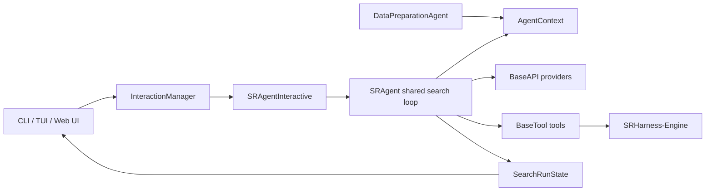

# SRHarness

SRHarness 是一个面向智能体符号回归的研究运行时。它让语言模型在受控工具集上分析数据、提出与检验公式，并用可审计的 R–C–L–K 搜索轨迹保存候选模型、诊断结果和模型调用成本。

本文是 SRHarness 本体的单页文档。除独立的 [SRHarness-Engine 文档](engine.md) 外，安装、快速开始、Web 工作台、Python API、扩展机制、运行状态和完整 API Reference 都位于本页，便于使用浏览器页面搜索定位。

- [English README](https://github.com/yuzhTHU/MySRAgent/blob/master/README.md)
- [中文 README](https://github.com/yuzhTHU/MySRAgent/blob/master/README.zh.md)
- [内部架构说明](https://github.com/yuzhTHU/MySRAgent/blob/master/src/sr_harness/README.md)
- [工具开发指南](https://github.com/yuzhTHU/MySRAgent/blob/master/src/sr_harness/tools/README.md)
- [CLI 约定](https://github.com/yuzhTHU/MySRAgent/blob/master/src/sr_harness/cli/README.zh.md)
- [测试说明](https://github.com/yuzhTHU/MySRAgent/blob/master/tests/README.md)

## 安装

SRHarness 要求 Python 3.12 或更新版本。核心、Web、科学工具和文档依赖可以分别安装：

```bash
git clone https://github.com/yuzhTHU/MySRAgent.git SRHarness
cd SRHarness
conda create -p ./venv python=3.12 -y
conda activate ./venv
pip install -e ".[dev,web]"
```

需要 PySR、PySINDy、PDF 等可选工具时安装：

```bash
pip install -e ".[tools]"
```

构建本文档时安装：

```bash
pip install -e ".[docs]"
mkdocs serve
```

复制环境变量模板时不要覆盖已经存在的 `.env`：

```bash
test -f .env || cp .env.sample .env
```

例如通过 OpenRouter 使用 DeepSeek：

```dotenv
OPENROUTER_API_KEY="sk-or-v1-..."
```

## 快速开始

### 命令行运行合成问题

下面的低预算配置会请求付费模型，但只运行一个 restart、一个分支和三步 refinement：

```bash
sr-harness synthetic \
  --equation "y = sin(x1 - x2)" \
  --x_low -10 \
  --x_high 10 \
  --llm_provider openrouter \
  --llm_model deepseek/deepseek-v4-flash-0731 \
  --force_initial_diagnostics \
  -R 1 -C 1 -L 3 -K 1
```

使用 `sr-harness --help` 查看子命令，使用 `sr-harness synthetic --help`、`sr-harness benchmark --help` 等查看完整参数。主命令包括：

| 子命令 | 用途 |
|---|---|
| `run` | 启动完整的交互式 SRHarness 工作台 |
| `synthetic` | 生成一个合成问题并执行低成本试运行 |
| `benchmark` | 运行 LLM-SRBench 或其他已注册算法 |
| `tool` | 查看或直接调用一个工具 |

### Python API

```python
import numpy as np
from sr_harness import SRAgent

x1 = np.linspace(-3.0, 3.0, 100)
x2 = np.linspace(3.0, -3.0, 100)

agent = SRAgent(
    llm_provider="openrouter",
    llm_model="deepseek/deepseek-v4-flash-0731",
    max_restart_loop=1,
    global_width=1,
    max_refinement_depth=3,
    local_sample_size=1,
    save_path="logs/python-example",
)
result = agent.run(
    X={"x1": x1, "x2": x2},
    y={"y": np.sin(x1 - x2)},
    problem_description="Discover y as a function of x1 and x2.",
)

if result["best_candidate"] is not None:
    best = result["candidates"][result["best_candidate"]]
    print(best["formula"])
```

`save_path=None` 是完整支持的无文件模式。节点身份、父子关系、候选公式和最终结果仍保存在 `agent.run_state` 中，只是不写入硬盘。

## Web 工作台

安装 Web 依赖并启动：

```bash
sr-harness run --host 127.0.0.1 --port 11001
```

`--workspace-dir` 保存对话注册表及每个对话各自的持久化工作区。未指定时，如果提供了 `--save-path` 或 `--save-dir`，系统会将对应保存路径用作工作区目录；否则使用临时目录并发出数据可能丢失的警告。已有文件或目录可以只读挂载到每个新对话的工作区根目录：

```bash
sr-harness run --workspace-dir ./workspaces --mount ./data.csv ./papers ./raw-tables --port 11001
```

每个输入保留自己的 basename，例如 `./papers` 显示为工作区中的 `papers/`。这些输入可被
数据准备 Agent、表格预览和下载接口读取，但不能被上传接口、`workspace_shell` 或沙箱代码
修改。多个输入的 basename 必须唯一；若两个路径都叫 `data.csv`，启动会直接报错，避免
静默覆盖或产生难以追踪的自动重命名。每个对话的普通工作区文件可被 AI 工具修改或删除。

默认情况下所有浏览器共享对话列表。面向多个互不信任的用户提供服务时，可添加
`--isolate-users`，按浏览器持久 Cookie 隔离每个用户可见的对话。
当 `--save-path` 或 `--save-dir` 提供持久保存路径时，服务会定期保存各对话的交互会话快照；
使用相同路径重启后会恢复时间线、设置、数据上下文、评测器选择和搜索记录。关闭时尚未完成的
模型输出或工具调用会恢复为“已中断”，不会伪装成仍在运行的任务。快照保存在
`<save-path>/sessions/` 中。

浏览器打开 `http://127.0.0.1:11001/`。启动时不会自动发起模型请求；只有提交数据准备任务或开始搜索后才会调用配置的模型。

### 数据准备与分析


“数据准备”页集中处理文件上传、样例数据和 Agent 交互；“数据分析”页集中处理数据选择、预览、变量角色、关系图与 Prompt。两个页面共同支持：

1. 上传 CSV、Excel 或工作区中的其他资料，也可生成 `demo.csv`。
2. 让数据准备 Agent 根据自然语言清洗、连接或补充数据。
3. 在统一变量表中设置目标、自变量和暂不使用的变量，并编辑变量描述。
4. 将变量拖入 X、Y、Hue、Size 槽，快速查看关系图。
5. 检查或编辑自动生成的 System Prompt 与 User Prompt。
6. 开始符号回归，并自动切换到执行时间线。

数据准备 Agent 与符号回归 Agent 使用各自的对话历史，但共享同一个 `AgentContext`。因此可以暂停搜索，返回数据页补充新特征，再让原来的符号回归对话带着已有证据继续研究。

### 执行时间线


执行时间线展示模型推理、回复、工具调用、参数、工具结果、单轮与累计 token/费用。右侧搜索树和候选公式与 R–C–L 节点联动；点击树节点或时间线坐标可以跳转到对应的“当前上下文”。运行中可以暂停、停止、插入指导，或者修改下一轮生效的模型、工具、skill 和 R–C–L–K 参数。

## R–C–L–K 搜索

| 维度 | 含义 |
|---|---|
| R — Restart | 使用历史优秀候选重新构造起始提示词 |
| C — Conversation | 同一 restart 下相互独立的对话分支 |
| L — Refinement | 单个分支中连续的模型—工具迭代 |
| K — Local sample | 同一步中并行采样的模型响应 |

一轮 L 的共享执行顺序是：读取控制指令、构造模型输入、请求模型、解析并执行工具、记录搜索节点、收集候选、更新科学状态与对话状态、记录用量、判断继续/换分支/重启/结束。`SRAgentInteractive` 复用同一个搜索循环，只覆盖人工控制、工作区和事件发布等交互行为。

## 数据准备与共享上下文

`AgentContext` 是多个 Agent 和工具共享的权威内存状态，主要保存：

- 完整对齐数据、当前目标和自变量；
- 变量描述、来源和数据版本；
- 当前训练/验证划分；
- 工作区与可选自定义 `Evaluator`；
- 最近一次数据变化。

```python
from sr_harness import AgentContext

context = AgentContext()
context.commit_data(
    {
        "year": [2020, 2021, 2022],
        "population": [1412.1, 1412.6, 1411.8],
        "gdp": [101.4, 114.9, 120.5],
    },
    target="population",
    features=["year", "gdp"],
    variable_descriptions={"gdp": "Annual GDP in trillion CNY."},
)
context.add_features(
    {"marriages": [8.14, 7.64, 6.84]},
    descriptions={"marriages": "Registered marriages in millions."},
    provenance={"marriages": "Public statistical table"},
)
```

运行中的 Agent 只在安全迭代边界接收数据版本变化，从而避免一个工具执行到一半时数据被替换。

## 自定义评估协议 {#custom-evaluator}

评测协议以 `BaseEvaluator(ABC)` 为抽象基类：它定义静态的 `fit()`、`evaluate()`、`split_data()` 协议，并提供 `calc_mse()`、`calc_rmse()`、`calc_mae()`、`calc_mape()`、`calc_r2()`、`calc_aic()`、`calc_bic()` 等独立指标函数。`DefaultEvaluator(BaseEvaluator)` 面向所有变量均为 `(N,)` 的普通表格数据；`GraphEvaluator(DefaultEvaluator)` 处理可广播的图或超图数组。具体任务可以继承 `DefaultEvaluator` 或 `GraphEvaluator` 只改写部分行为，差异较大时也可以直接继承 `BaseEvaluator`。

上下文通过 `context.data` 暴露当前 data split，通过 `context.target` 和 `context.num_nodes` 暴露数据元信息；`context.args` 是只保存运行控制参数的 `argparse.Namespace`。实现应先取出最少参数，再把这些参数传给辅助方法；不要把整个 `context` 或 `context.args` 继续向下透传：

```python
from sr_harness import DefaultEvaluator

class TrajectoryEvaluator(DefaultEvaluator):
    @staticmethod
    def fit(expression, context, target):
        return expression.fit(context.data, target).expression

    @staticmethod
    def evaluate(expression, context, target):
        # Integrate an ODE and compare its trajectory with observations.
        prediction = expression.evaluate(context.data)
        return {"trajectory_rmse": 0.01, "complexity": len(expression)}
```

`fit()` 必须返回可直接求值且所有参数均已绑定的 `Expression`；`evaluate()` 返回当前 split 的扁平 metrics 字典。`complexity` 与 MSE、R² 等指标统一位于每个 train/validation split 的 `metrics` 中。把实例传给 `SRAgent(evaluator=...)` 后，它会进入共享上下文，供相应的科学工具调用。

## 工具与 Skill

工具继承 `BaseTool`。复杂运行时对象通过 `self.context` 读取，`execute()` 只暴露适合模型生成的简单参数。它的英文 Google 风格 docstring 同时用于生成工具说明和参数 schema：

```python
from typing import Any
from sr_harness.tools import BaseTool
from sr_harness.core import ToolMetadata

@BaseTool.register("column_range")
class ColumnRangeTool(BaseTool):
    metadata = ToolMetadata(name="column_range")

    def execute(self, column: str) -> dict[str, Any]:
        """Return the numerical range of one data column.

        Args:
            column: Column name in the shared dataset.

        Returns:
            dict[str, Any]: Minimum and maximum values.
        """
        values = self.context.data[column]
        return {"minimum": float(values.min()), "maximum": float(values.max())}
```

更完整的注册、自定义 skill 工具和错误处理约定见[工具开发指南](https://github.com/yuzhTHU/MySRAgent/blob/master/src/sr_harness/tools/README.md)。

## 运行状态与持久化

`SearchRunState` 始终以内存为权威数据源。设置 `save_path` 时，它额外写入：

| 文件 | 内容 |
|---|---|
| `run.json` | `run_id` 和 Agent 配置摘要 |
| `nodes.jsonl` | 搜索节点、父关系、prompt、响应、工具结果和用量 |
| `result.json` | 候选列表、Pareto 下标和最佳候选下标 |
| `response.jsonl` | 原始模型响应和 token/价格信息 |
| `tool_calls.jsonl` | 工具调用记录 |

Web API 直接读取活动会话中的 `SearchRunState`，不会依赖这些文件存在。

## 架构



`Agent` 提供 API、parser 和工具执行机制；`DataPreparationAgent` 与 `SRAgent` 在此基础上实现不同任务。交互管理器是前端适配边界，不拥有科学搜索状态。

## Benchmark 示例

先下载 LLM-SRBench 数据，再运行一个低预算问题：

```bash
sr-harness benchmark \
  --algorithm sr_harness \
  --datasets lsrtransform \
  --problem_names II.6.15b_1_0 \
  --exp_name smoke_lsrtransform \
  --llm_provider openrouter \
  --llm_model deepseek/deepseek-v4-flash-0731 \
  -R 1 -C 1 -L 3 -K 1
```

只有 `benchmark` 支持 `--anonymize`。它替换 Agent 可见的变量名与科学描述，但不改变数值观测。

模型检查点通过独立维护脚本管理：`python scripts/download_models.py --help` 和 `python scripts/upload_models.py --help`。

## 文档维护

API Reference 从源码 docstring 生成并嵌入本页：

```bash
python scripts/check_docstrings.py
python scripts/generate_api_reference.py
mkdocs build --strict
```

新增公开方法时必须提供英文 Google 风格 docstring。`utils/` 是内部通用函数集合，不纳入这项检查和 API Reference。

# API Reference

以下内容由 `scripts/generate_api_reference.py` 生成，不应手工修改。

<!-- API_REFERENCE_START -->

## `sr_harness.agents.agent`

### `sr_harness.agents.agent.Agent`

Base class for tool-using agents.

Subclasses own their task loop and scientific state. This class only owns
common API/tool initialization and tool execution mechanics.

#### `Agent.run(self, *args, **kwargs)`

Run the agent's task loop.


**Args**

- `*args`: Positional inputs accepted by the concrete agent.
- `**kwargs`: Keyword inputs accepted by the concrete agent.

#### `Agent.initialize_tools(self, context: AgentContext) -> None`

Bind one shared context to every tool, parser, and API adapter.


**Args**

- `context`: Shared agent and tool context.

#### `Agent.set_messages(self, messages: list[dict[str, Any]]) -> None`

Expose the current prompt through the shared tool context.


**Args**

- `messages`: Conversation messages in provider-compatible order.

#### `Agent.execute_action(self, actions: list[ToolCall]) -> list[ToolCallResult]`

Execute tool calls serially.


**Args**

- `actions`: Tool calls to execute.


**Returns**

    Results in the same order as ``actions``.

#### `Agent.execute_action_parallel(self, actions: list[ToolCall], max_workers: int) -> list[ToolCallResult]`

Execute independent tool calls in worker processes.


**Args**

- `actions`: Tool calls to execute.
- `max_workers`: Maximum number of parallel workers.


**Returns**

    Results in the same order as ``actions``.

## `sr_harness.agents.data_preparation_agent`

### `sr_harness.agents.data_preparation_agent.DataPreparationAgent`

Turn workspace and web evidence into the shared structured dataset.

#### `DataPreparationAgent.initialize_tools(self, context: AgentContext) -> None`

Bind configured skills before constructing context-aware tools.


**Args**

- `context`: Shared agent and tool context.

#### `DataPreparationAgent.run(self, instruction: str) -> dict[str, Any]`

Continue the persistent preparation conversation until it yields control.


**Args**

- `instruction`: Natural-language instruction for the agent.


**Returns**

- `dict[str, Any]`: The operation result.

## `sr_harness.agents.evaluator_construction_agent`

### `sr_harness.agents.evaluator_construction_agent.EvaluatorConstructionAgent`

Construct and validate evaluator scripts without mutating live context state.

#### `EvaluatorConstructionAgent.run(self, instruction: str) -> dict[str, Any]`

## `sr_harness.agents.sr_agent`

### `sr_harness.agents.sr_agent.SRAgent`

Agent that performs an R-C-L-K symbolic-regression search.

#### `SRAgent.run(self, X: Dict[str, np.ndarray], y: Dict[str, np.ndarray] | np.ndarray, problem_description: str) -> Dict[str, Any]`

Run the configured operation.


**Args**

- `X`: Input feature arrays keyed by variable name.
- `y`: Target data or target expression.
- `problem_description`: Natural-language description of the discovery task.


**Returns**

- `Dict[str, Any]`: The operation result.

#### `SRAgent.prepare_tool_context(self, tool_context: AgentContext)`

Prepare resources and context shared by initialized tools.


**Args**

- `tool_context`: Shared context used to initialize tools.

#### `SRAgent.search(self, X: Dict[str, np.ndarray], y: Dict[str, np.ndarray], problem_description: str) -> Dict[str, Any]`

Run the R-C-L search after data, tools, parser, and API are initialized.

        Each refinement step builds the prompt, requests the model, executes tools,
        records the search node, collects candidates, updates the conversation, and
        evaluates the termination hook.


**Args**

- `X`: Input feature arrays keyed by variable name.
- `y`: Target data or target expression.
- `problem_description`: Natural-language description of the discovery task.


**Returns**

- `Dict[str, Any]`: The operation result.

#### `SRAgent.create_initial_buffer(self, problem_description, X, y, restart_records)`

Combine initial prompts with the first progress message for a branch.


**Args**

- `problem_description`: Natural-language description of the discovery task.
- `X`: Input feature arrays keyed by variable name.
- `y`: Target data or target expression.
- `restart_records`: Ranked candidates used to seed a restart.

#### `SRAgent.create_initial_prompt_messages(self, problem_description, X, y, restart_records)`

Create the finalized system and user messages without buffer metadata.

#### `SRAgent.create_initial_system_prompt(self, restart_records) -> str`

Create the initial system prompt independently of the branch buffer.

#### `SRAgent.create_initial_user_prompt(self, problem_description, X, y, restart_records) -> str`

Create the initial user prompt independently of the branch buffer.

#### `SRAgent.customize_initial_prompts(self, messages, *, X, y)`

Customize finalized initial prompt messages before buffer insertion.

#### `SRAgent.on_buffer_messages_added(self, messages, **coordinate: int) -> None`

Observe messages after they enter a conversation buffer.

#### `SRAgent.prepare_model_messages(self, buffer: List[Dict[str, Any]], R, L, C) -> List[Dict[str, Any]]`

Prepare the messages sent to the model for one iteration.


**Args**

- `buffer`: Conversation history buffer.
- `R`: One-based restart index.
- `L`: One-based refinement-step index.
- `C`: One-based conversation-branch index.


**Returns**

- `List[Dict[str, Any]]`: The operation result.

#### `SRAgent.prepare_iteration(self, buffer: List[Dict[str, Any]], R, L, C) -> str | None`

Apply mode-specific control changes before constructing this iteration's prompt.


**Args**

- `buffer`: Conversation history buffer.
- `R`: One-based restart index.
- `L`: One-based refinement-step index.
- `C`: One-based conversation-branch index.


**Returns**

- `str | None`: The operation result.

#### `SRAgent.refresh_data(self) -> dict[str, Any] | None`

Apply a newly committed shared-data revision and describe the change.

#### `SRAgent.finish_iteration(self, buffer: List[Dict[str, Any]], R, L, C) -> str | None`

Return a terminal status when the current search should stop.


**Args**

- `buffer`: Conversation history buffer.
- `R`: One-based restart index.
- `L`: One-based refinement-step index.
- `C`: One-based conversation-branch index.


**Returns**

- `str | None`: The operation result.

#### `SRAgent.run_initial_diagnostics(self, R, L, C) -> Dict[str, str]`

Run the mandatory branch-opening diagnostics and format them for the LLM.


**Args**

- `R`: One-based restart index.
- `L`: One-based refinement-step index.
- `C`: One-based conversation-branch index.


**Returns**

- `Dict[str, str]`: The operation result.

#### `SRAgent.request_llm(self, prompt: List[Dict[str, Any]], R, L, C, stream_callback=None)`

Run the ``request llm`` operation.


**Args**

- `prompt`: Prompt messages sent to the model.
- `R`: One-based restart index.
- `L`: One-based refinement-step index.
- `C`: One-based conversation-branch index.
- `stream_callback`: Optional callback invoked for streamed model updates.

#### `SRAgent.execute_tool_calls(self, response_list, R, L, C)`

Execute tool calls from model responses and preserve sample grouping.


**Args**

- `response_list`: Model responses for the current step.
- `R`: One-based restart index.
- `L`: One-based refinement-step index.
- `C`: One-based conversation-branch index.

#### `SRAgent.record_tool_calls(self, tool_calls: List[ToolCall], results: List[ToolCallResult], R, L, C, forced: bool=False) -> None`

Persist tool calls from either the LLM or framework-enforced diagnostics.


**Args**

- `tool_calls`: Tool calls returned by the model.
- `results`: Result records to process.
- `R`: One-based restart index.
- `L`: One-based refinement-step index.
- `C`: One-based conversation-branch index.
- `forced`: The forced value.

#### `SRAgent.update_conversation(self, buffer: List[Dict[str, Any]], response_list: List[Tuple[str, List[ToolCall], Dict[str, Any]]], results_list: List[List[ToolCallResult]], node_parents: Dict[str, str], R, L, C)`

Update buffer.


**Args**

- `buffer`: Conversation history buffer.
- `response_list`: Model responses for the current step.
- `results_list`: Tool results aligned with model responses.
- `node_parents`: The node parents value.
- `R`: One-based restart index.
- `L`: One-based refinement-step index.
- `C`: One-based conversation-branch index.

#### `SRAgent.build_progress_message(self, L)`

Build process message.


**Args**

- `L`: One-based refinement-step index.

#### `SRAgent.push_candidate(self, record: CandidateRecord) -> None`

Run the ``push candidate`` operation.


**Args**

- `record`: Search or candidate record.

#### `SRAgent.collect_candidates(self, response_list, results_list, R, L, C)`

Validate candidate tool results and add them to the run state.


**Args**

- `response_list`: Model responses for the current step.
- `results_list`: Tool results aligned with model responses.
- `R`: One-based restart index.
- `L`: One-based refinement-step index.
- `C`: One-based conversation-branch index.

#### `SRAgent.log_info(self, response_list, R, L, C)`

Run the ``log info`` operation.


**Args**

- `response_list`: Model responses for the current step.
- `R`: One-based restart index.
- `L`: One-based refinement-step index.
- `C`: One-based conversation-branch index.

#### `SRAgent.record_llm_result(self, llm_result, R, L, C) -> Dict[str, Any] | None`

Record llm result.


**Args**

- `llm_result`: The llm result value.
- `R`: One-based restart index.
- `L`: One-based refinement-step index.
- `C`: One-based conversation-branch index.


**Returns**

- `Dict[str, Any] | None`: The operation result.

#### `SRAgent.record_search_iteration(self, response_list, results_list, parent_nodes, prompt, usage, R, L, C)`

Record one visualization node for each local sample.


**Args**

- `response_list`: Model responses for the current step.
- `results_list`: Tool results aligned with model responses.
- `parent_nodes`: Parent search nodes by response.
- `prompt`: Prompt messages sent to the model.
- `usage`: Token and price usage information.
- `R`: One-based restart index.
- `L`: One-based refinement-step index.
- `C`: One-based conversation-branch index.

#### `SRAgent.format_progress(self, R, L, C)`

Format progress.


**Args**

- `R`: One-based restart index.
- `L`: One-based refinement-step index.
- `C`: One-based conversation-branch index.

#### `SRAgent.get_ranking_metric(self, record)`

Return the configured ranking metric and its display label.


**Args**

- `record`: Search or candidate record.

#### `SRAgent.candidate_sort_key(self, record)`

Return the ranking key for a candidate-like record.


**Args**

- `record`: Search or candidate record.

#### `SRAgent.candidate_to_dict(record: CandidateRecord) -> dict[str, Any]`

Adapt a candidate to utilities that consume split results at top level.


**Args**

- `record`: Search or candidate record.


**Returns**

- `dict[str, Any]`: The operation result.

#### `SRAgent.best_candidate(self) -> CandidateRecord | None`

Run the ``best candidate`` operation.


**Returns**

- `CandidateRecord | None`: The operation result.

#### `SRAgent.get_pareto_front(self) -> list[CandidateRecord]`

Return candidates on the metric-complexity Pareto front.


**Returns**

- `list[CandidateRecord]`: The operation result.

#### `SRAgent.build_search_result(self, status: str, R: int | None, L: int | None, C: int | None)`

Build a serializable search result for the current run state.


**Args**

- `status`: Run completion status.
- `R`: One-based restart index.
- `L`: One-based refinement-step index.
- `C`: One-based conversation-branch index.

## `sr_harness.agents.sr_agent_interactive`

### `sr_harness.agents.sr_agent_interactive.SRAgentInteractive`

Interactive symbolic-regression agent controlled by an interaction manager.

#### `SRAgentInteractive.on_buffer_messages_added(self, messages, **coordinate: int) -> None`

Publish each system/user message exactly when it enters the buffer.

#### `SRAgentInteractive.initialize_tools(self, context: AgentContext) -> None`

Initialize tools and attach the active hard-interrupt event.

#### `SRAgentInteractive.prepare_tool_context(self, tool_context: AgentContext)`

Add interaction resources to the tool context for the duration of a run.


**Args**

- `tool_context`: Shared context used to initialize tools.

#### `SRAgentInteractive.prepare_iteration(self, buffer, R: int, L: int, C: int) -> str | None`

Apply queued human guidance before the prompt is constructed.


**Args**

- `buffer`: Conversation history buffer.
- `R`: One-based restart index.
- `L`: One-based refinement-step index.
- `C`: One-based conversation-branch index.


**Returns**

- `str | None`: The operation result.

#### `SRAgentInteractive.build_data_refresh_message(change: dict[str, Any]) -> dict[str, str]`

Turn a structured data revision into guidance for the next model turn.

#### `SRAgentInteractive.finish_iteration(self, buffer, R: int, L: int, C: int) -> str | None`

Keep interactive runs open and yield tool-free responses to the human.


**Args**

- `buffer`: Conversation history buffer.
- `R`: One-based restart index.
- `L`: One-based refinement-step index.
- `C`: One-based conversation-branch index.


**Returns**

- `str | None`: The operation result.

#### `SRAgentInteractive.create_initial_system_prompt(self, restart_records) -> str`

Create the interactive system prompt with workspace guidance.

#### `SRAgentInteractive.customize_initial_prompts(self, messages, *, X, y)`

Apply UI-provided descriptions and prompt overrides.

#### `SRAgentInteractive.request_llm(self, prompt, R: int, L: int, C: int)`

Request the model while publishing frontend-neutral progress events.


**Args**

- `prompt`: Prompt messages sent to the model.
- `R`: One-based restart index.
- `L`: One-based refinement-step index.
- `C`: One-based conversation-branch index.

#### `SRAgentInteractive.tool_schema(self, name: str) -> dict[str, Any]`

Return the schema exposed by one initialized tool.


**Args**

- `name`: Registered name.


**Returns**

- `dict[str, Any]`: The operation result.

#### `SRAgentInteractive.execute_action(self, actions)`

Execute tools serially with safe control boundaries and UI events.


**Args**

- `actions`: Tool calls to execute.

#### `SRAgentInteractive.collect_candidates(self, *args, **kwargs)`

Update scientific state and publish its current ranked view.


**Args**

- `*args`: Parsed command-line arguments.
- `**kwargs`: The kwargs value.

#### `SRAgentInteractive.record_tool_calls(self, tool_calls, results, R, L, C, forced=False)`

Persist tool calls and expose framework-enforced calls to the UI.


**Args**

- `tool_calls`: Tool calls returned by the model.
- `results`: Result records to process.
- `R`: One-based restart index.
- `L`: One-based refinement-step index.
- `C`: One-based conversation-branch index.
- `forced`: The forced value.

#### `SRAgentInteractive.execute_action_parallel(self, actions, max_workers: int)`

Execute action parallel.


**Args**

- `actions`: Tool calls to execute.
- `max_workers`: Maximum number of parallel workers.

## `sr_harness.api.base_api`

### `sr_harness.api.base_api.BaseAPI`

Common request, parser, and tool-call behavior for LLM providers.

#### `BaseAPI.cancel(self) -> None`

Request cancellation when a provider offers no stronger primitive.

#### `BaseAPI.build_parser(self, parser: ToolParserName) -> BaseParser | None`

Build parser.


**Args**

- `parser`: Argument parser to configure.


**Returns**

- `BaseParser | None`: The operation result.

#### `BaseAPI.tool_description_text(self) -> str`

Format available tools for a model using a text-based parser.


**Returns**

- `str`: The operation result.

#### `BaseAPI.tool_description_json(self) -> List[Dict]`

Build OpenAI-compatible native function descriptions.


**Returns**

- `List[Dict]`: The operation result.

#### `BaseAPI.add_tool_description(self, messages: List[Dict[str, str]]) -> List[Dict[str, str]]`

Add text-formatted tool instructions to the leading system message.


**Args**

- `messages`: Conversation messages in provider-compatible order.


**Returns**

- `List[Dict[str, str]]`: The operation result.

#### `BaseAPI.normalize_openai_tool_calls(self, tool_calls: List[Any]) -> List[ToolCall]`

Normalize provider-native function calls into internal ToolCall objects.


**Args**

- `tool_calls`: Tool calls returned by the model.


**Returns**

- `List[ToolCall]`: The operation result.

#### `BaseAPI.setup_proxy(self) -> None`

Configure HTTP/HTTPS proxy variables from MY_PROXY when provided.

## `sr_harness.api.deepseek_api`

### `sr_harness.api.deepseek_api.DeepSeekAPI`

DeepSeek provider adapter.

## `sr_harness.api.gemini_api`

### `sr_harness.api.gemini_api.GeminiAPI`

Google Gemini provider adapter.

## `sr_harness.api.lmstudio_api`

### `sr_harness.api.lmstudio_api.LMStudioAPI`

LLM API adapter for an LM Studio server.

``LMSTUDIO_ENDPOINT`` may point at LM Studio's native ``/api/v1/chat``
endpoint, as recommended by LM Studio. SRAgent needs multi-turn messages
and custom function tools, so requests are sent to the OpenAI-compatible
``/v1/chat/completions`` endpoint on the same server.

#### `LMStudioAPI.normalize_endpoint(endpoint: str) -> str`

Return the OpenAI-compatible chat-completions URL.


**Args**

- `endpoint`: The endpoint value.


**Returns**

- `str`: The operation result.

## `sr_harness.api.manual_api`

### `sr_harness.api.manual_api.ManualAPI`

Interactive manual-response provider adapter.

## `sr_harness.api.openai_api`

### `sr_harness.api.openai_api.OpenAIAPI`

OpenAI-compatible provider adapter.

#### `OpenAIAPI.build_native_tool_description(self, use_chat_completions=False) -> List[Dict]`

Build native tool description.


**Args**

- `use_chat_completions`: The use chat completions value.


**Returns**

- `List[Dict]`: The operation result.

#### `OpenAIAPI.create_responses(self, messages: List[Dict[str, str]], n=1, max_tokens=4096, temperature=1.0, top_p=1.0) -> Generator[str, None, Dict]`

Create responses.


**Args**

- `messages`: Conversation messages in provider-compatible order.
- `n`: The n value.
- `max_tokens`: The max tokens value.
- `temperature`: The temperature value.
- `top_p`: The top p value.


**Returns**

- `Generator[str, None, Dict]`: The operation result.

#### `OpenAIAPI.create_chat_completions(self, messages: List[Dict[str, str]], n=1, max_tokens=4096, temperature=1.0, top_p=1.0) -> Generator[str, None, Dict]`

Create chat completions.


**Args**

- `messages`: Conversation messages in provider-compatible order.
- `n`: The n value.
- `max_tokens`: The max tokens value.
- `temperature`: The temperature value.
- `top_p`: The top p value.


**Returns**

- `Generator[str, None, Dict]`: The operation result.

#### `OpenAIAPI.parse_usage(self, response: Response) -> Dict`

Parse usage.


**Args**

- `response`: Provider response object.


**Returns**

- `Dict`: The operation result.

#### `OpenAIAPI.parse_chat_completions_usage(self, response: ChatCompletion) -> Dict`

Parse chat completions usage.


**Args**

- `response`: Provider response object.


**Returns**

- `Dict`: The operation result.

## `sr_harness.api.openrouter_api`

### `sr_harness.api.openrouter_api.OpenRouterAPI`

OpenRouter provider adapter.

## `sr_harness.api.siliconflow_api`

### `sr_harness.api.siliconflow_api.SiliconFlowAPI`

SiliconFlow provider adapter.

#### `SiliconFlowAPI.qwen3_8b(self, url, headers, payload) -> Generator[str, None, Dict]`

Run the ``qwen3 8b`` operation.


**Args**

- `url`: The url value.
- `headers`: The headers value.
- `payload`: Serializable event payload.


**Returns**

- `Generator[str, None, Dict]`: The operation result.

#### `SiliconFlowAPI.deepseek_v3(self, url, headers, payload) -> Generator[str, None, Dict]`

Run the ``deepseek v3`` operation.


**Args**

- `url`: The url value.
- `headers`: The headers value.
- `payload`: Serializable event payload.


**Returns**

- `Generator[str, None, Dict]`: The operation result.

## `sr_harness.cli`

### `sr_harness.cli.setup_parser(parser: argparse.ArgumentParser | None=None) -> argparse.ArgumentParser`

Configure the command-line argument parser.


**Args**

- `parser`: Argument parser to configure.


**Returns**

- `argparse.ArgumentParser`: The operation result.

### `sr_harness.cli.main(args: argparse.Namespace) -> int`

Run the command and return its process exit code.


**Args**

- `args`: Parsed command-line arguments.


**Returns**

- `int`: The operation result.

### `sr_harness.cli.entrypoint() -> int`

Run the installed command-line entry point.


**Returns**

- `int`: The operation result.

## `sr_harness.cli.benchmark`

### `sr_harness.cli.benchmark.setup_parser(parser: argparse.ArgumentParser | None=None) -> argparse.ArgumentParser`

Configure the command-line argument parser.


**Args**

- `parser`: Argument parser to configure.


**Returns**

- `argparse.ArgumentParser`: The operation result.

### `sr_harness.cli.benchmark.load_problems(dataset_name: str, data_root: str, hf_repo_id='nnheui/llm-srbench') -> List[Problem]`

Load problems.


**Args**

- `dataset_name`: The dataset name value.
- `data_root`: The data root value.
- `hf_repo_id`: The hf repo id value.


**Returns**

- `List[Problem]`: The operation result.

### `sr_harness.cli.benchmark.anonymize_problem(problem: Problem) -> Problem`

Return an agent-facing anonymized copy of a benchmark problem.


**Args**

- `problem`: The problem value.


**Returns**

- `Problem`: The operation result.

### `sr_harness.cli.benchmark.compute_metrics(y_pred: np.ndarray, y_true: np.ndarray) -> Dict[str, float]`

Compute metrics.


**Args**

- `y_pred`: Predicted target values.
- `y_true`: Observed target values.


**Returns**

- `Dict[str, float]`: The operation result.

### `sr_harness.cli.benchmark.evaluate_problem(args, problem: Problem, sr_fn: Callable, exp_path: Path) -> Dict`

Run the ``evaluate problem`` operation.


**Args**

- `args`: Parsed command-line arguments.
- `problem`: The problem value.
- `sr_fn`: The sr fn value.
- `exp_path`: The exp path value.


**Returns**

- `Dict`: The operation result.

### `sr_harness.cli.benchmark.log_result(result: Dict)`

Run the ``log result`` operation.


**Args**

- `result`: Result mapping to format or update.

### `sr_harness.cli.benchmark.aggregate_results(results: List[Dict]) -> Dict`

Run the ``aggregate results`` operation.


**Args**

- `results`: Result records to process.


**Returns**

- `Dict`: The operation result.

### `sr_harness.cli.benchmark.conclude_results(results: List[Dict], llmsr_datasets: List[str], save_path: str)`

Run the ``conclude results`` operation.


**Args**

- `results`: Result records to process.
- `llmsr_datasets`: The llmsr datasets value.
- `save_path`: Optional output path.

### `sr_harness.cli.benchmark.run_benchmark(args: argparse.Namespace) -> int`

Run the ``run benchmark`` operation.


**Args**

- `args`: Parsed command-line arguments.


**Returns**

- `int`: The operation result.

### `sr_harness.cli.benchmark.main(args: argparse.Namespace) -> int`

Run LLM-SRBench from CLI arguments.


**Args**

- `args`: Parsed command-line arguments.


**Returns**

- `int`: The operation result.

## `sr_harness.cli.run`

### `sr_harness.cli.run.setup_parser(parser: argparse.ArgumentParser | None=None) -> argparse.ArgumentParser`

Configure the command-line argument parser.


**Args**

- `parser`: Argument parser to configure.


**Returns**

- `argparse.ArgumentParser`: The operation result.

### `sr_harness.cli.run.main(args: argparse.Namespace) -> int`

Run the command and return its process exit code.


**Args**

- `args`: Parsed command-line arguments.


**Returns**

- `int`: The operation result.

## `sr_harness.cli.synthetic`

### `sr_harness.cli.synthetic.setup_parser(parser: argparse.ArgumentParser | None=None) -> argparse.ArgumentParser`

Configure the command-line argument parser.


**Args**

- `parser`: Argument parser to configure.


**Returns**

- `argparse.ArgumentParser`: The operation result.

### `sr_harness.cli.synthetic.make_dataset(args)`

Run the ``make dataset`` operation.


**Args**

- `args`: Parsed command-line arguments.

### `sr_harness.cli.synthetic.build_agent_options(args: argparse.Namespace) -> dict`

Build the validated SRAgent configuration for this run.


**Args**

- `args`: Parsed command-line arguments.


**Returns**

- `dict`: The operation result.

### `sr_harness.cli.synthetic.run_experiment(args: argparse.Namespace) -> dict`

Run the ``run experiment`` operation.


**Args**

- `args`: Parsed command-line arguments.


**Returns**

- `dict`: The operation result.

### `sr_harness.cli.synthetic.main(args: argparse.Namespace) -> int`

Run a synthetic SRAgent experiment from CLI arguments.


**Args**

- `args`: Parsed command-line arguments.


**Returns**

- `int`: The operation result.

## `sr_harness.cli.tool`

### `sr_harness.cli.tool.load_json_text(text: str) -> dict[str, Any]`

Load json text.


**Args**

- `text`: Text to process.


**Returns**

- `dict[str, Any]`: The operation result.

### `sr_harness.cli.tool.load_params(params: str | None=None, params_file: str | None=None) -> dict[str, Any]`

Load params.


**Args**

- `params`: The params value.
- `params_file`: The params file value.


**Returns**

- `dict[str, Any]`: The operation result.

### `sr_harness.cli.tool.decode_npz_value(value: np.ndarray) -> Any`

Run the ``decode npz value`` operation.


**Args**

- `value`: Input value.


**Returns**

- `Any`: The operation result.

### `sr_harness.cli.tool.load_context(path: str | Path, target: str | None=None) -> AgentContext`

Load a BaseTool context from context.npz.


**Args**

- `path`: Filesystem path.
- `target`: Target name or target values.


**Returns**

- `dict[str, Any]`: The operation result.

### `sr_harness.cli.tool.setup_parser(parser: argparse.ArgumentParser | None=None) -> argparse.ArgumentParser`

Configure the command-line argument parser.


**Args**

- `parser`: Argument parser to configure.


**Returns**

- `argparse.ArgumentParser`: The operation result.

### `sr_harness.cli.tool.tool_class(name: str) -> type[BaseTool]`

Run the ``tool class`` operation.


**Args**

- `name`: Registered name.


**Returns**

- `type[BaseTool]`: The operation result.

### `sr_harness.cli.tool.main(args: argparse.Namespace) -> int`

Run the command and return its process exit code.


**Args**

- `args`: Parsed command-line arguments.


**Returns**

- `int`: The operation result.

## `sr_harness.core.api`

### `sr_harness.core.api.APICallResult`

Wrapper for LLM generator that captures the return value.

Example:
    >>> api = OpenAIAPI(model='gpt-4o-mini')
    >>> result = api("Hello", n=3)  # Returns APICallResult
    >>> for content, tool_call in result:
    ...     print(content, tool_call)  # Stream generated content and tool calls
    >>> print(result.usage)     # Access via property
    >>> print(result.contents)  # List of generated contents

#### `APICallResult.usage(self) -> dict`

Token & Price usage statistics.


**Returns**

- `dict`: The operation result.

#### `APICallResult.return_value(self) -> dict`

Alias for the generator return value.


**Returns**

- `dict`: The operation result.

#### `APICallResult.contents(self) -> dict`

Raw API contents.


**Returns**

- `dict`: The operation result.

#### `APICallResult.tool_calls(self) -> list`

Tool calls returned by the provider.


**Returns**

- `list`: The operation result.

## `sr_harness.core.context`

### `sr_harness.core.context.AgentContext`

One authoritative context containing data, metadata, and runtime arguments.

#### `AgentContext.invalidate_splits(self) -> None`


#### `AgentContext.with_data(self, data: dict[str, np.ndarray]) -> AgentContext`

Create a context view over ``data`` while preserving runtime configuration.

#### `AgentContext.train_split(self) -> AgentContext`


#### `AgentContext.validation_split(self) -> AgentContext`


#### `AgentContext.axis_names(self) -> tuple[str, ...]`


#### `AgentContext.variable_names(self) -> tuple[str, ...]`


#### `AgentContext.feature_names(self) -> tuple[str, ...]`


#### `AgentContext.commit_context_data(self, loaded: dict[str, Any]) -> dict[str, Any]`


#### `AgentContext.commit_data(self, data: dict[str, Any], *, target: str, features: list[str] | None=None, variable_descriptions: dict[str, str] | None=None) -> dict[str, Any]`


#### `AgentContext.add_features(self, features: dict[str, Any], *, descriptions: dict[str, str] | None=None) -> dict[str, Any]`


#### `AgentContext.update_selection(self, *, target: str, features: list[str], variable_descriptions: dict[str, str] | None=None) -> dict[str, Any]`


#### `AgentContext.schema(self) -> dict[str, Any]`

## `sr_harness.core.context_data`

### `sr_harness.core.context_data.ContextManifestError`

Raised when a context-data manifest cannot be validated.

### `sr_harness.core.context_data.load_context_data(directory: str | Path) -> dict[str, Any]`

Validate and load one manifest-backed ``context.data`` directory.

### `sr_harness.core.context_data.inspect_context_data(directory: str | Path) -> dict[str, Any]`

Return validation diagnostics without raising for manifest errors.

### `sr_harness.core.context_data.update_context_data_descriptions(directory: str | Path, descriptions: dict[str, str]) -> dict[str, Any]`

Update variable and axis descriptions in ``manifest.json``.

The complete store is validated before the edit. An atomic replacement is
used when the directory permits creating entries. If the directory is
read-only but ``manifest.json`` itself is writable, the existing file is
updated in place, matching normal POSIX file-permission semantics. Because
only existing string-valued description fields are changed, structural
validity is preserved. The returned mapping matches :func:`load_context_data`.

## `sr_harness.core.search`

### `sr_harness.core.search.json_value(value: Any) -> Any`

Convert runtime values to standards-compliant JSON values.


**Args**

- `value`: Input value.


**Returns**

- `Any`: The operation result.

### `sr_harness.core.search.SearchCoordinate`

Coordinates of one R-C-L-K search sample.

### `sr_harness.core.search.ParentLink`

Typed link to a parent search node.

#### `ParentLink.to_dict(self) -> dict[str, str]`

Return a serializable dictionary representation.


**Returns**

- `dict[str, str]`: The operation result.

### `sr_harness.core.search.SearchNode`

Recorded state for one search-tree node.

#### `SearchNode.to_dict(self, *, include_detail: bool=True) -> dict[str, Any]`

Return a serializable dictionary representation.


**Args**

- `include_detail`: Whether to include detailed payloads.


**Returns**

- `dict[str, Any]`: The operation result.

### `sr_harness.core.search.CandidateRecord`

Candidate formula and its evaluation details.

#### `CandidateRecord.split_metrics(self, split: str) -> dict[str, Any]`

Run the ``split metrics`` operation.


**Args**

- `split`: Data split name.


**Returns**

- `dict[str, Any]`: The operation result.

#### `CandidateRecord.metric(self, name: str, split: str) -> Any`

Run the ``metric`` operation.


**Args**

- `name`: Registered name.
- `split`: Data split name.


**Returns**

- `Any`: The operation result.

#### `CandidateRecord.complexity(self) -> Any`

Run the ``complexity`` operation.


**Returns**

- `Any`: The operation result.

#### `CandidateRecord.to_dict(self) -> dict[str, Any]`

Return a serializable dictionary representation.


**Returns**

- `dict[str, Any]`: The operation result.

#### `CandidateRecord.display_dict(self) -> dict[str, Any]`

Return a flattened view for UI rendering without mutating the record.


**Returns**

- `dict[str, Any]`: The operation result.

### `sr_harness.core.search.SearchResult`

Final snapshot of one symbolic-regression run.

#### `SearchResult.to_dict(self) -> dict[str, Any]`

Return a serializable dictionary representation.


**Returns**

- `dict[str, Any]`: The operation result.

### `sr_harness.core.search.SearchRunState`

Authoritative in-memory state for one run, with optional persistence.

#### `SearchRunState.now() -> str`

Run the ``now`` operation.


**Returns**

- `str`: The operation result.

#### `SearchRunState.node_label(R: int, C: int, L: int, K: int) -> str`

Run the ``node label`` operation.


**Args**

- `R`: One-based restart index.
- `C`: One-based conversation-branch index.
- `L`: One-based refinement-step index.
- `K`: One-based local-sample index.


**Returns**

- `str`: The operation result.

#### `SearchRunState.node_id(self, R: int, C: int, L: int, K: int) -> str`

Run the ``node id`` operation.


**Args**

- `R`: One-based restart index.
- `C`: One-based conversation-branch index.
- `L`: One-based refinement-step index.
- `K`: One-based local-sample index.


**Returns**

- `str`: The operation result.

#### `SearchRunState.parent_link(parent_node_id: str, relation: ParentRelation) -> ParentLink`

Run the ``parent link`` operation.


**Args**

- `parent_node_id`: The parent node id value.
- `relation`: Relation expression that binds symbolic indices.


**Returns**

- `ParentLink`: The operation result.

#### `SearchRunState.register_iteration(self, response_list: list, results_list: list, parents: tuple[ParentLink, ...], prompt: list[dict[str, Any]], usage: dict[str, Any], R: int, L: int, C: int) -> None`

Register iteration.


**Args**

- `response_list`: Model responses for the current step.
- `results_list`: Tool results aligned with model responses.
- `parents`: Parent links for the new search nodes.
- `prompt`: Prompt messages sent to the model.
- `usage`: Token and price usage information.
- `R`: One-based restart index.
- `L`: One-based refinement-step index.
- `C`: One-based conversation-branch index.

#### `SearchRunState.push_candidate(self, candidate: CandidateRecord) -> bool`

Run the ``push candidate`` operation.


**Args**

- `candidate`: The candidate value.


**Returns**

- `bool`: The operation result.

#### `SearchRunState.update_diagnostics(self, formula: str, diagnostics: dict[str, Any]) -> None`

Update diagnostics.


**Args**

- `formula`: Symbolic formula string.
- `diagnostics`: Diagnostic values to store.

#### `SearchRunState.ranked_candidates(self) -> list[CandidateRecord]`

Run the ``ranked candidates`` operation.


**Returns**

- `list[CandidateRecord]`: The operation result.

#### `SearchRunState.pareto_indices(self, candidates: list[CandidateRecord] | None=None) -> list[int]`

Run the ``pareto indices`` operation.


**Args**

- `candidates`: The candidates value.


**Returns**

- `list[int]`: The operation result.

#### `SearchRunState.result(self, status: str, progress: str) -> SearchResult`

Run the ``result`` operation.


**Args**

- `status`: Run completion status.
- `progress`: Human-readable search progress.


**Returns**

- `SearchResult`: The operation result.

#### `SearchRunState.records(self, *, include_detail: bool=False) -> list[dict[str, Any]]`

Run the ``records`` operation.


**Args**

- `include_detail`: Whether to include detailed payloads.


**Returns**

- `list[dict[str, Any]]`: The operation result.

#### `SearchRunState.node_count(self) -> int`

Run the ``node count`` operation.


**Returns**

- `int`: The operation result.

#### `SearchRunState.latest_coordinate(self) -> SearchCoordinate | None`

Return the coordinate of the most recently recorded search node.


**Returns**

- `SearchCoordinate | None`: The operation result.

#### `SearchRunState.export_state(self) -> dict[str, Any]`

Return enough durable state to rebuild this run after a restart.

#### `SearchRunState.from_state(cls, snapshot: dict[str, Any], save_path: str | Path | None=None) -> 'SearchRunState'`

Rebuild a run from :meth:`export_state` without replaying work.

#### `SearchRunState.node_record(self, node_id: str) -> dict[str, Any] | None`

Run the ``node record`` operation.


**Args**

- `node_id`: The node id value.


**Returns**

- `dict[str, Any] | None`: The operation result.

## `sr_harness.core.tool`

### `sr_harness.core.tool.ToolMetadata`

Description and parameter schema exposed for a tool.

``description`` and ``parameters`` may be omitted so ``BaseTool`` can infer
them from the implementation's signature and docstring.

### `sr_harness.core.tool.ToolCall`

Normalized tool call emitted by LLM APIs and parsers.

### `sr_harness.core.tool.ToolCallResult`

Structured result returned by the tool execution boundary.

``result`` retains the complete machine-readable value, while
``result_str`` is the bounded representation returned to the model.

#### `ToolCallResult.get(self, key: str, default: Any=None) -> Any`

Run the ``get`` operation.


**Args**

- `key`: The key value.
- `default`: Fallback value.


**Returns**

- `Any`: The operation result.

## `sr_harness.evaluator.default_evaluator`

### `sr_harness.evaluator.default_evaluator.DefaultEvaluator`

Default implementation and extension point for formula evaluation.

#### `DefaultEvaluator.split(cls, context: AgentContext) -> ContextSplits`


#### `DefaultEvaluator.fit(cls, f: engine.Expression, y: engine.Expression, context: AgentContext) -> engine.Expression`


#### `DefaultEvaluator.evaluate(cls, f: engine.Expression, y: engine.Expression, context: AgentContext) -> MetricDict`


#### `DefaultEvaluator.fit_candidate(cls, f: engine.Expression, context: AgentContext) -> engine.Expression`


#### `DefaultEvaluator.evaluate_candidate(cls, f: engine.Expression, context: AgentContext) -> MetricDict`

## `sr_harness.evaluator.graph_evaluator`

### `sr_harness.evaluator.graph_evaluator.GraphEvaluator`

Evaluate variables with ``(..., N/E/H)`` graph-aligned dimensions.

#### `GraphEvaluator.fit(cls, f: engine.Expression, y: engine.Expression, context: AgentContext) -> engine.Expression`


#### `GraphEvaluator.evaluate(cls, f: engine.Expression, y: engine.Expression, context: AgentContext) -> MetricDict`


#### `GraphEvaluator.split(cls, context: AgentContext) -> ContextSplits`

## `sr_harness.evaluator.load_custom_evaluator`

### `sr_harness.evaluator.load_custom_evaluator.evaluator_source(evaluator_id: str) -> str`


### `sr_harness.evaluator.load_custom_evaluator.evaluator_catalog() -> list[dict[str, str]]`


### `sr_harness.evaluator.load_custom_evaluator.create_builtin_evaluator(evaluator_id: str) -> DefaultEvaluator`


### `sr_harness.evaluator.load_custom_evaluator.evaluator_filename(class_name: str) -> str`


### `sr_harness.evaluator.load_custom_evaluator.load_custom_evaluator(source: str | None=None, file: Path | None=None) -> DefaultEvaluator`

Load exactly one ``DefaultEvaluator`` subclass as an evaluator package module.

## `sr_harness.parser.base_parser`

### `sr_harness.parser.base_parser.BaseParser`

Base class for model tool-call parsers.

#### `BaseParser.format_tools(self) -> str`

Format tools.


**Returns**

- `str`: The operation result.

#### `BaseParser.parse_response(self, response: str) -> List[ToolCall]`

Parse response.


**Args**

- `response`: Provider response object.


**Returns**

- `List[ToolCall]`: The operation result.

#### `BaseParser.format_tool_calls(self, tool_calls: List[ToolCall]) -> str`

Format tool calls.


**Args**

- `tool_calls`: Tool calls returned by the model.


**Returns**

- `str`: The operation result.

#### `BaseParser.format_tool_result_messages(self, tool_calls: List[ToolCall], results: List[ToolCallResult]) -> List[Dict[str, Any]]`

Format tool result messages.


**Args**

- `tool_calls`: Tool calls returned by the model.
- `results`: Result records to process.


**Returns**

- `List[Dict[str, Any]]`: The operation result.

## `sr_harness.parser.json_parser`

### `sr_harness.parser.json_parser.JSONParser`

Parser for JSON-formatted tool calls.

#### `JSONParser.format_tools(self) -> str`

Format tools.


**Returns**

- `str`: The operation result.

#### `JSONParser.parse_response(self, response: str) -> List[ToolCall]`

Parse response.


**Args**

- `response`: Provider response object.


**Returns**

- `List[ToolCall]`: The operation result.

#### `JSONParser.format_tool_calls(self, tool_calls: List[ToolCall]) -> str`

Format tool calls.


**Args**

- `tool_calls`: Tool calls returned by the model.


**Returns**

- `str`: The operation result.

## `sr_harness.parser.openai_parser`

### `sr_harness.parser.openai_parser.OpenAIParser`

Parser for native OpenAI-compatible tool calls.

#### `OpenAIParser.format_tools(self) -> str`

Format tools.


**Returns**

- `str`: The operation result.

#### `OpenAIParser.parse_response(self, response: str) -> List[ToolCall]`

Parse response.


**Args**

- `response`: Provider response object.


**Returns**

- `List[ToolCall]`: The operation result.

#### `OpenAIParser.format_tool_calls(self, tool_calls: List[ToolCall]) -> str`

Format tool calls.


**Args**

- `tool_calls`: Tool calls returned by the model.


**Returns**

- `str`: The operation result.

#### `OpenAIParser.format_tool_result_messages(self, tool_calls: List[ToolCall], results: List[ToolCallResult]) -> List[Dict[str, Any]]`

Format tool result messages.


**Args**

- `tool_calls`: Tool calls returned by the model.
- `results`: Result records to process.


**Returns**

- `List[Dict[str, Any]]`: The operation result.

## `sr_harness.parser.text_parser`

### `sr_harness.parser.text_parser.TextParser`

Parser for tagged text tool calls.

#### `TextParser.format_tools(self) -> str`

Format tool list into a description string for LLM.


**Returns**

    Formatted tool description string.

#### `TextParser.parse_response(self, response: str) -> List[ToolCall]`

Parse response.


**Args**

- `response`: Provider response object.


**Returns**

- `List[ToolCall]`: The operation result.

#### `TextParser.format_tool_calls(self, tool_calls: List[ToolCall]) -> str`

Format tool calls.


**Args**

- `tool_calls`: Tool calls returned by the model.


**Returns**

- `str`: The operation result.

## `sr_harness.parser.xml_parser`

### `sr_harness.parser.xml_parser.XMLParser`

Parser for XML-formatted tool calls.

## `sr_harness.runtime.interaction_manager`

### `sr_harness.runtime.interaction_manager.PendingMessage`

A user message waiting to be inserted at an agent boundary.

### `sr_harness.runtime.interaction_manager.InteractionManager`

Own the controls and observable event stream of exactly one agent.

#### `InteractionManager.state(self) -> InteractionState`

Return the authoritative execution state.

#### `InteractionManager.is_interrupting(self) -> bool`

Return whether the active operation should abort promptly.

#### `InteractionManager.cancellation_signal(self) -> _CancellationSignal`

Expose a read-only Event-like cancellation adapter to tools.

#### `InteractionManager.status(self) -> dict[str, Any]`

Return a serializable control snapshot.

#### `InteractionManager.command(self, action: InteractionAction, message: str | None=None) -> dict[str, Any]`

Apply a user control command to this agent.

#### `InteractionManager.request_pause(self) -> None`

Request a quiet pause, such as after a tool-free response.

#### `InteractionManager.start_agent_execution(self) -> list[PendingMessage]`

Enter running state and consume messages that start this execution.

#### `InteractionManager.finish_agent_execution(self) -> None`

Mark a naturally completed agent execution as idle.

#### `InteractionManager.wait(self) -> Iterator[list[PendingMessage]]`

Yield boundary messages and resume only after the agent inserts them.

#### `InteractionManager.cancellable(self, cancel: Callable[[], None]) -> Iterator[None]`

Register the cancellation callback for the current blocking operation.

#### `InteractionManager.publish_event(self, kind: InteractionEventKind, payload: Mapping[str, Any]) -> dict[str, Any]`

Append one observable event to this agent's timeline.

#### `InteractionManager.get_recent_events(self, after_sequence: int=0) -> dict[str, Any]`

Return retained events newer than a consumer-owned sequence cursor.

#### `InteractionManager.export_state(self) -> dict[str, Any]`

Return the durable portion of this manager's state.

#### `InteractionManager.restore_state(self, snapshot: Mapping[str, Any]) -> bool`

Restore durable state and interrupt work that died with the process.

Returns whether an in-flight operation had to be converted into an
interruption. Runtime callbacks and locks are deliberately never
restored.

### `sr_harness.runtime.interaction_manager.SRInteractionManager`

Interaction manager with symbolic-regression branch commands.

#### `SRInteractionManager.command(self, action: SRInteractionAction, message: str | None=None) -> dict[str, Any]`

Apply a common command or queue an SR branch transition.

#### `SRInteractionManager.consume_search_transition(self) -> Literal['next_c', 'next_r'] | None`

Consume the newest queued branch transition.

#### `SRInteractionManager.status(self) -> dict[str, Any]`

Include the pending SR branch transition in the control snapshot.

#### `SRInteractionManager.export_state(self) -> dict[str, Any]`

Include pending search transitions in the durable snapshot.

#### `SRInteractionManager.restore_state(self, snapshot: Mapping[str, Any]) -> bool`

Restore common state plus queued symbolic-search transitions.

## `sr_harness.runtime.model_router`

### `sr_harness.runtime.model_router.ModelRoute`

Selected provider/model route and its rationale.

### `sr_harness.runtime.model_router.ModelRouter`

Choose a cheap base model or an optional stronger model per request.

#### `ModelRouter.has_strong_backend(self) -> bool`

Run the ``has strong backend`` operation.


**Returns**

- `bool`: The operation result.

#### `ModelRouter.assess(self, task: str, feature_count: int) -> tuple[int, list[str]]`

Run the ``assess`` operation.


**Args**

- `task`: The task value.
- `feature_count`: The feature count value.


**Returns**

- `tuple[int, list[str]]`: The operation result.

#### `ModelRouter.route(self, *, task_score: int, task_reasons: list[str], refinement_step: int) -> ModelRoute`

Run the ``route`` operation.


**Args**

- `task_score`: The task score value.
- `task_reasons`: The task reasons value.
- `refinement_step`: The refinement step value.


**Returns**

- `ModelRoute`: The operation result.

## `sr_harness.skills.skill_manager`

### `sr_harness.skills.skill_manager.Skill`

Metadata for one runtime skill.

### `sr_harness.skills.skill_manager.SkillManager`

Manage built-in, runtime, and custom skills through one interface.

#### `SkillManager.register_tool_docs(self, tool_cls_list: Iterable[type]) -> None`

Materialize documentation from enabled tools as read-only runtime skills.


**Args**

- `tool_cls_list`: Tool classes to register.

#### `SkillManager.discover_tool_skills(self) -> list[Skill]`

Return all registered skills that contain a ``tool.py`` file.


**Returns**

- `list[Skill]`: The operation result.

#### `SkillManager.load_skills(self) -> dict[str, Skill]`

Load skills.


**Returns**

- `dict[str, Skill]`: The operation result.

#### `SkillManager.get_skill(self, name: str) -> Skill`

Return skill.


**Args**

- `name`: Registered name.


**Returns**

- `Skill`: The operation result.

#### `SkillManager.search_skills(self, query: str, limit: int=5) -> list[Skill]`

Rank skills by lexical overlap in name and discovery description.


**Args**

- `query`: Search query.
- `limit`: Maximum number of results.


**Returns**

- `list[Skill]`: The operation result.

#### `SkillManager.read_skill(self, name: str, file_path: str='SKILL.md') -> str`

Read skill.


**Args**

- `name`: Registered name.
- `file_path`: Path relative to the selected resource.


**Returns**

- `str`: The operation result.

#### `SkillManager.get_skill_tree(self, name: str) -> list[str]`

Return skill tree.


**Args**

- `name`: Registered name.


**Returns**

- `list[str]`: The operation result.

#### `SkillManager.set_skill(self, name: str, content: str, file_path: str='SKILL.md', force: bool=False) -> Skill`

Create a custom skill file or update a file in an editable skill.


**Args**

- `name`: Registered name.
- `content`: Text content.
- `file_path`: Path relative to the selected resource.
- `force`: Whether to overwrite an existing resource.


**Returns**

- `Skill`: The operation result.

## `sr_harness.tools.base_tool`

### `sr_harness.tools.base_tool.ToolRunAbort`

Raise from a tool to bypass BaseTool.__call__ error handling.

### `sr_harness.tools.base_tool.BaseTool`

工具基类。所有工具都应继承此类，并设置 / 实现以下字段和方法：
- metadata: ToolMetadata 实例，提供工具的名称、描述和参数 schema（若不提供则尝试自动推断）
- execute(): 工具的核心执行方法，接受 LLM 生成的参数并返回结果字典。工具的 execute 方法应该尽量保持参数简单，复杂的上下文信息（如数据）可以通过工具实例的 context 属性传入。
- format_result_dict(): 可选的类方法，用于将 execute 的结果字典格式化为字符串，供 LLM 阅读。默认实现是直接转换为字符串，不同工具可以根据需要重写此方法以提供更友好的结果展示。

#### `BaseTool.get_doc(cls) -> dict[str, str] | None`

Return optional documentation to expose as a runtime skill.

#### `BaseTool.execute(self) -> Dict[str, Any]`

Execute the tool and return its result.

The parameters of this method are generated by the LLM and should therefore remain simple. Pass complex runtime context, such as data, through the tool instance's ``context`` attribute. Implementations must be safe for concurrent process or thread execution.

The text before ``Args`` supplies ``metadata.description``; argument descriptions supply the parameter schema descriptions. The signature and type hints supply its JSON schema. Automatic inference supports common scalar, list, and dictionary types. Define ``ToolMetadata.parameters`` explicitly for more complex schemas.


**Returns**

    A structured result dictionary.

#### `BaseTool.format_result_dict(cls, result: Dict[str, Any]) -> str`

Format a tool result as text for the language model.

Subclasses may override this method to provide a clearer presentation.


**Args**

- `result`: Structured result returned by ``execute``.


**Returns**

    Text to append to the model conversation.

#### `BaseTool.cancel(self) -> None`

Request cancellation when a tool offers no stronger primitive.

#### `BaseTool.normalize_formula(cls, eq: str, *, strip_modules: bool=True) -> str`

Validate and normalize an agent-provided formula before parsing it.


**Args**

- `eq`: Formula text supplied by the agent.
- `strip_modules`: Whether to remove supported module prefixes.


**Returns**

    The normalized formula text.

#### `BaseTool.parse_formula(cls, eq: str) -> engine.Expression`

Normalize and parse a formula with constants supported by all tools.


**Args**

- `eq`: Formula text supplied by the agent.


**Returns**

    The parsed symbolic expression.

#### `BaseTool.truncate_result_str(cls, text: str) -> str`

Bound text sent to the LLM while preserving the full raw result.


**Args**

- `text`: Tool-result text to limit.


**Returns**

    The original text or a length-limited prefix with a truncation note.

#### `BaseTool.to_tool_list(cls, tools_used: list[str] | None=None) -> list[dict]`

Load OpenAI-compatible function-tool definitions.


**Args**

- `tools_used`: Tool names to include, or ``None`` for all registered tools.


**Returns**

    Function-tool definitions in OpenAI-compatible format.

#### `BaseTool.load_tool_list(cls, tools_used: list[str] | None=None) -> list[dict]`

Load tool metadata for text and JSON parsers.


**Args**

- `tools_used`: Tool names to include, or ``None`` for all registered tools.


**Returns**

    Names, descriptions, and parameter schemas for the selected tools.

#### `BaseTool.load_tool_classes(cls, tools_used: list[str] | None=None) -> list[type['BaseTool']]`

Load tool classes for native function calling.


**Args**

- `tools_used`: Tool names to include, or ``None`` for all registered tools.


**Returns**

    The selected registered tool classes.

#### `BaseTool.load_custom_tool(cls, path: str) -> dict`

Load or update one ``BaseTool`` stored in a skill's ``tool.py``.

Reloading the same path replaces its previous registration. A load failure leaves that path unavailable, and a name owned by another path is rejected.


**Args**

- `path`: Path to the custom Python tool module.


**Returns**

    Registration details for the loaded tool.

#### `BaseTool.discover_custom_tools(cls, skill_manager: SkillManager) -> list[type['BaseTool']]`

Discover custom tools.


**Args**

- `skill_manager`: The skill manager value.


**Returns**

- `list[type['BaseTool']]`: The operation result.

#### `BaseTool.to_dict(cls) -> dict`

Export an OpenAI-compatible function-tool definition.


**Returns**

    The tool name, description, and JSON parameter schema.

#### `BaseTool.infer_tool_description(cls) -> str`

Extract a tool description from the text before ``Args`` in ``execute``.


**Returns**

    The inferred description or a placeholder when none is provided.

#### `BaseTool.infer_tool_parameters(cls) -> Dict[str, Any]`

Infer a parameter schema from the ``execute`` signature and docstring.

Automatic inference covers common Python and typing annotations. Complex constraints, enumerations, and formats should be declared explicitly in ``ToolMetadata.parameters``.


**Returns**

    An object-shaped JSON schema for model-supplied arguments.

#### `BaseTool.parse_args_docstring(func: callable) -> dict[str, str]`

Extract argument descriptions from a Google-style docstring.


**Args**

- `func`: Callable whose docstring describes its parameters.


**Returns**

    Descriptions keyed by parameter name.

#### `BaseTool.parse_args_typehints(cls, annotation: Any) -> Dict[str, Any]`

Convert a common Python type annotation to JSON Schema.


**Args**

- `annotation`: Type annotation to convert.


**Returns**

    A JSON Schema fragment.

#### `BaseTool.parse_json_type(value_type: Any) -> str`

Map a Python literal type to a JSON Schema type name.


**Args**

- `value_type`: Python type to inspect.


**Returns**

    A JSON type name, or an empty string for an unsupported type.

#### `BaseTool.calculate_metrics(cls, f: engine.Expression, y_true: np.ndarray, y_pred: np.ndarray) -> Dict[str, Any]`

Calculate metrics for precomputed target and prediction arrays.

This helper lets code-defined models reuse the symbolic tools' metric definitions.


**Args**

- `f`: Candidate expression used to compute structural complexity.
- `y_true`: Observed target values.
- `y_pred`: Predicted target values.


**Returns**

    Fit, correlation, information-criterion, and complexity metrics.

#### `BaseTool.evaluate(self, f: engine.Expression, y: engine.Expression, show_diagnostics: bool=True, fit: bool=False) -> Dict[str, Any]`

Evaluate a symbolic prediction against a symbolic target.

Metrics, including formula complexity, are supplied by the active evaluator. Residual diagnostics include an error profile, worst samples, and strong residual-variable correlations.


**Args**

- `f`: Symbolic prediction expression.
- `y`: Symbolic target expression.
- `show_diagnostics`: Whether to include residual diagnostics.
- `fit`: Whether to fit parameters on the training split before scoring.


**Returns**

    Candidate eligibility and metrics for each available data split.

#### `BaseTool.failed_evaluation(self, formula: str='(None)') -> Dict[str, Any]`

Build the common result shape when a formula-producing backend fails.


**Args**

- `formula`: Formula or placeholder to report.

**Returns**

    A non-candidate result with infinite error metrics.

#### `BaseTool.format_evaluation_result(cls, result: Dict[str, Any], title: str='Formula evaluation') -> str`

Format the common formula-evaluation schema for an LLM.


**Args**

- `result`: Evaluation mapping produced by ``evaluate``.
- `title`: Heading shown above the formatted result.


**Returns**

    Concise formula, metric, warning, and diagnostic text.

#### `BaseTool.residual_diagnostics(cls, y_true: np.ndarray, y_pred: np.ndarray, data: Dict[str, Any]=None, target_expression: str=None, max_samples: int=3, max_correlations: int=5) -> Dict[str, Any]`

Return compact diagnostics for prediction residuals.


**Args**

- `y_true`: Observed target values.
- `y_pred`: Predicted target values.
- `data`: Optional variables used to explain residual patterns.
- `target_expression`: Target label included in diagnostic rows.
- `max_samples`: Maximum number of worst samples to include.
- `max_correlations`: Maximum number of residual correlations to include.


**Returns**

    Error profile, worst samples, and strongest residual correlations.

#### `BaseTool.correlation_coefficients(x: np.ndarray, y: np.ndarray) -> tuple[float, float]`

Return finite-sample Pearson and Spearman coefficients.

Undefined correlations, including constant inputs, are returned as NaN. Warnings for these mathematically valid edge cases are suppressed.


**Args**

- `x`: First numeric sample.
- `y`: Second numeric sample.


**Returns**

    Pearson and Spearman correlation coefficients.

### `sr_harness.tools.base_tool.is_numeric_array(data: List[Any]) -> bool`

Run the ``is numeric array`` operation.


**Args**

- `data`: Data arrays keyed by variable name.


**Returns**

- `bool`: The operation result.

## `sr_harness.tools.call_llm`

### `sr_harness.tools.call_llm.LLMTool`

Implementation of the l l m tool.

#### `LLMTool.execute(self, llm_provider: str, llm_model: str, messages: List[Dict[str, str]] | str) -> Dict[str, Any]`

Call LLM API.


**Args**

- `llm_provider`: LLM provider name, e.g., "openai", "deepseek", "gemini".
- `llm_model`: Model name, e.g., "gpt-4o-mini", "deepseek-chat".
- `messages`: List of messages, each as [{"role": "user"|"assistant", "content": "..."}, ...].

## `sr_harness.tools.call_pysr`

### `sr_harness.tools.call_pysr.PySRTool`

Implementation of the py s r tool.

#### `PySRTool.execute(self, binary_operators: List[str], unary_operators: List[str], x: List[str]=None, y: str=None, timeout: int=30, maxsize: int=25, max_samples: int=500, show_diagnostics: bool=True) -> Dict[str, Any]`

Run PySR (genetic programming symbolic regression) to evolve mathematical expressions that fit the data.
PySR perform evolutionary search for symbolic formulas.
It is powerful for discovering complex nonlinear relationships including trigonometric, exponential, sqrt, and nested functions.
However, it is also computationally intensive and requires careful tuning of operators and variables to find good formulas within reasonable time.
You MUST specify the binary and unary operators based on your hypothesis about the data.

This tool can return candidate formulas for submission when `y` is the target variable and `x` does not depend on the target variable.


**Args**

- `binary_operators`: List of binary operators for PySR to use. Choose from: "+", "-", "*", "/", "^".
        Select operators you believe are relevant to the underlying formula.
- `unary_operators`: List of unary operators for PySR to use. Choose from: "sin", "cos", "exp", "log", "sqrt", "square", "cube", "abs", "tanh", "sign". Select operators based on your hypothesis about the data.
- `x`: List of input feature names to use. If not specified, all features except target are used.
        Expressions are also supported, e.g., ["sin(x1)", "(x1-x2)**2"].
- `y`: Target variable name. If not specified, the default target variable is used.
        Expressions are also supported, e.g., "log(y)", "y - x1"
- `timeout`: Maximum search time in seconds (default 30, max 120).
        If PySR did not find a good formula in a previous run, increase timeout (e.g., 60 or 90) to give it more search time.
- `maxsize`: Maximum expression complexity in number of nodes (10-40). Larger allows more complex formulas.
- `max_samples`: Maximum number of data samples to use for fitting (for speed). Data is subsampled if larger.
- `show_diagnostics`: Whether final metrics should include compact residual diagnostics.

#### `PySRTool.format_result_dict(cls, result: Dict[str, Any]) -> str`

Format a tool result for the language model.


**Args**

- `result`: Result mapping to format or update.


**Returns**

- `str`: The operation result.

## `sr_harness.tools.call_sindy`

### `sr_harness.tools.call_sindy.SINDyTool`

Implementation of the s i n dy tool.

#### `SINDyTool.execute(self, x: List[str]=None, y: str=None, poly_degree: int=3, include_trig: bool=False, threshold: float=0.1, max_samples: int=5000, show_diagnostics: bool=True) -> Dict[str, Any]`

Run SINDy (Sparse Identification of Nonlinear Dynamics) to discover symbolic expressions from data.
SINDy builds a library of candidate nonlinear functions and uses sparse regression (STLSQ) to find
a parsimonious combination that explains the target variable.
Best suited for polynomial, interaction, and trigonometric relationships.

This tool can return candidate formulas for submission when `y` is the target variable and `x` does not depend on the target variable.


**Args**

- `x`: List of input feature names to use. If not specified, all features except target are used.
        Expressions are also supported, e.g., ["sin(x1)", "(x1-x2)**2"].
- `y`: Target variable name. If not specified, the default target variable is used.
        Expressions are also supported, e.g., "log(y)", "y - x1"
- `poly_degree`: Maximum polynomial degree for the feature library (1-5). Higher values find more complex relationships but are slower.
- `include_trig`: Whether to include sin/cos terms in the feature library. Enable this if you suspect trigonometric relationships.
- `threshold`: Sparsity threshold for STLSQ optimizer (0.01-1.0). Larger values produce sparser (simpler) formulas.
- `max_samples`: Maximum number of data samples to use for fitting (for speed). Data is subsampled if larger.
- `show_diagnostics`: Whether final metrics should include compact residual diagnostics.

#### `SINDyTool.format_result_dict(cls, result: Dict[str, Any]) -> str`

Format a tool result for the language model.


**Args**

- `result`: Result mapping to format or update.


**Returns**

- `str`: The operation result.

## `sr_harness.tools.code_executor`

### `sr_harness.tools.code_executor.root_module_name(module_name: str) -> str`

Run the ``root module name`` operation.


**Args**

- `module_name`: The module name value.


**Returns**

- `str`: The operation result.

### `sr_harness.tools.code_executor.sandbox_module(name: str)`

Register a factory that supplies an approved sandbox module.


**Args**

- `module_name`: Import name exposed inside the sandbox.


**Returns**

    A decorator for the module factory.

### `sr_harness.tools.code_executor.sandbox_builtin(name: str)`

Register a factory that supplies an approved sandbox builtin.


**Args**

- `name`: Builtin name exposed inside the sandbox.


**Returns**

    A decorator for the builtin factory.

### `sr_harness.tools.code_executor.LimitedWriter`

StringIO with a hard byte-ish character cap for untrusted output.

#### `LimitedWriter.write(self, text: str) -> int`

Run the ``write`` operation.


**Args**

- `text`: Text to process.


**Returns**

- `int`: The operation result.

### `sr_harness.tools.code_executor.SandBoxCodeExecutor`

Implementation of the sand box code executor.

#### `SandBoxCodeExecutor.validate_code(cls, code: str) -> Dict[str, bool | str]`

Validate code before sending it to the sandbox process.


**Args**

- `code`: Python source to validate.


**Returns**

    The parsed syntax tree.

#### `SandBoxCodeExecutor.validate_eval(cls, node: ast.Call) -> Dict[str, bool | str]`

Validate that a node is a safe, pure mathematical expression.


**Args**

- `node`: Syntax-tree node to validate.


**Returns**

    ``True`` when validation succeeds.

#### `SandBoxCodeExecutor.validate_math_expression(cls, expression: str) -> Dict[str, bool | str]`

Validate a pure mathematical expression.


**Args**

- `expression`: Expression source to validate.


**Returns**

    ``True`` when validation succeeds.

#### `SandBoxCodeExecutor.validate_import(cls, module_name: str) -> Tuple[bool, str]`

Validate import.


**Args**

- `module_name`: The module name value.


**Returns**

- `Tuple[bool, str]`: The operation result.

#### `SandBoxCodeExecutor.sandbox_worker(cls, program: str, stdin_text: str, timeout_seconds: int, memory_limit_mb: int, output_limit_bytes: int, result_queue: mp.Queue) -> None`

Run the ``sandbox worker`` operation.


**Args**

- `program`: The program value.
- `stdin_text`: The stdin text value.
- `timeout_seconds`: The timeout seconds value.
- `memory_limit_mb`: The memory limit mb value.
- `output_limit_bytes`: The output limit bytes value.
- `result_queue`: The result queue value.

#### `SandBoxCodeExecutor.prepare_sandbox_runtime(cls, **sandbox_context) -> None`

Prepare sandbox runtime.


**Args**

- `**sandbox_context`: The sandbox context value.

#### `SandBoxCodeExecutor.install_sandbox_resources(cls) -> None`

Run the ``install sandbox resources`` operation.

#### `SandBoxCodeExecutor.apply_resource_limits(cls, timeout_seconds: int, memory_limit_mb: int) -> None`

Run the ``apply resource limits`` operation.


**Args**

- `timeout_seconds`: The timeout seconds value.
- `memory_limit_mb`: The memory limit mb value.

#### `SandBoxCodeExecutor.limited_import(cls, name: str, globals=None, locals=None, fromlist=(), level: int=0) -> ModuleType`

Restrict imports in the sandbox to approved modules.


**Args**

- `name`: Module name requested by sandboxed code.
- `globals`: Import globals supplied by Python.
- `locals`: Import locals supplied by Python.
- `fromlist`: Requested imported attributes.
- `level`: Relative-import level.


**Returns**

    The approved sandbox module.

#### `SandBoxCodeExecutor.restricted_module_for_import(cls, name: str, module: ModuleType, fromlist=()) -> ModuleType`

Run the ``restricted module for import`` operation.


**Args**

- `name`: Registered name.
- `module`: The module value.
- `fromlist`: The fromlist value.


**Returns**

- `ModuleType`: The operation result.

#### `SandBoxCodeExecutor.iter_sandbox_resource_factories(cls, kind: str)`

Collect factories registered by ``sandbox_module`` and ``sandbox_builtin``.


**Args**

- `kind`: Resource kind to collect.


**Returns**

    Resource factories keyed by their sandbox-visible names.

#### `SandBoxCodeExecutor.create_safe_eval(cls, **sandbox_context) -> Any`

Create an ``eval`` function restricted to validated mathematical expressions.


**Args**

- `**sandbox_context`: Runtime values available to sandbox resource factories.


**Returns**

    A safe expression evaluator.

#### `SandBoxCodeExecutor.create_fake_sys_module(cls, stdin_text: str='', **sandbox_context) -> ModuleType`

Create a restricted ``sys`` module for sandboxed code.

Only a limited set of attributes is exposed. Standard input can be supplied explicitly, while standard output and error are redirected to the parent process streams.


**Args**

- `stdin_text`: Text exposed through ``sys.stdin``.


**Returns**

    The restricted module.

### `sr_harness.tools.code_executor.CodeExecutorTool`

Implementation of the code executor tool.

#### `CodeExecutorTool.execute(self, program: str, timeout_seconds: int=DEFAULT_TIMEOUT_SECONDS, memory_limit_mb: int=DEFAULT_MEMORY_LIMIT_MB, output_limit_bytes: int=DEFAULT_OUTPUT_LIMIT_BYTES) -> Dict[str, Any]`

Execute Python code and return printed output.
1) Use `import sys, json; data_dict = json.loads(sys.stdin.read())` to access data mapping variable names to lists.
2) Use `print()` to produce output.
3) The code is executed in a restricted sandbox with resource limits.
4) numpy and scipy are available, but libraries like matplotlib, pandas, scikit-learn are forbidden.
5) exec() is forbidden. eval() is allowed only for math expression strings that
   pass a strict AST whitelist; otherwise define and call your own functions.


**Args**

- `program`: Python code string to execute, starting with `import sys, json; data_dict = json.loads(sys.stdin.read())` to access input data.
- `timeout_seconds`: Wall-clock timeout in seconds. The effective value is capped.
- `memory_limit_mb`: Address-space memory limit in MB. The effective value is capped.
- `output_limit_bytes`: Limit on the amount of output (in bytes) that can be produced.

#### `CodeExecutorTool.format_result_dict(cls, result: Dict[str, Any]) -> str`

Format a tool result for the language model.


**Args**

- `result`: Result mapping to format or update.


**Returns**

- `str`: The operation result.

#### `CodeExecutorTool.extract_code(cls, code: str) -> str`

Run the ``extract code`` operation.


**Args**

- `code`: The code value.


**Returns**

- `str`: The operation result.

#### `CodeExecutorTool.serialization(cls, value: Any) -> Any`

Run the ``serialization`` operation.


**Args**

- `value`: Input value.


**Returns**

- `Any`: The operation result.

#### `CodeExecutorTool.terminate_process(cls, process: mp.Process) -> None`

Run the ``terminate process`` operation.


**Args**

- `process`: The process value.

#### `CodeExecutorTool.bounded_int(cls, value: Any, default: int, minimum: int, maximum: int) -> int`

Run the ``bounded int`` operation.


**Args**

- `value`: Input value.
- `default`: Fallback value.
- `minimum`: The minimum value.
- `maximum`: The maximum value.


**Returns**

- `int`: The operation result.

## `sr_harness.tools.constant_fit`

### `sr_harness.tools.constant_fit.ConstantFitTool`

Implementation of the constant fit tool.

#### `ConstantFitTool.execute(self, eq: str, y: str=None, use_eq_as_y: bool=False) -> Dict[str, Any]`

Compare nearby simple constants at each numeric position in eq.

Search nearby integers and fractions (denominator <= 12, numerator <= 32),
pi, e, sqrt(2)..sqrt(10),
and signed half/double multiples of these named constants. Candidates
must be within 5% relative distance of the original number. The Pareto
front maximizes validation R2 if validation data exist, otherwise train
R2, and minimizes the count of original numeric constants left unchanged.


**Args**

- `eq`: Required formula containing at least one numeric constant.
- `y`: Target variable or expression; overrides use_eq_as_y when supplied.
- `use_eq_as_y`: If y is omitted, compare against original eq rather
        than the tool context's target variable.

#### `ConstantFitTool.format_result_dict(cls, result: Dict[str, Any]) -> str`

Format a tool result for the language model.


**Args**

- `result`: Result mapping to format or update.


**Returns**

- `str`: The operation result.

## `sr_harness.tools.create_skill`

### `sr_harness.tools.create_skill.AuthoringState`

Implementation of the authoring state.

### `sr_harness.tools.create_skill.CreateSkill`

Implementation of the create skill.

#### `CreateSkill.execute(self, request: str='', force: bool=False, history_messages: int | None=None) -> Dict[str, Any]`

Create a reusable skill in one tool call. The tool passes the current Agent 
buffer and request to the configured LLM, determines whether the skill is 
instruction-only, data-analysis, or formula-proposal, supplies the matching 
demo, iterates internally to complete the draft, and then writes the skill.


**Args**

- `request`: Explain the reusable capability or lesson to capture. The current
        Agent conversation and the tool-call message are supplied automatically.
- `force`: Replace an existing editable skill's SKILL.md and tool.py. Other files
        are preserved; read-only skills cannot be replaced.
- `history_messages`: Number of most recent Agent messages to provide to the
        authoring LLM. Defaults to all available messages.

#### `CreateSkill.format_result_dict(cls, result: Dict[str, Any]) -> str`

Format a tool result for the language model.


**Args**

- `result`: Result mapping to format or update.


**Returns**

- `str`: The operation result.

## `sr_harness.tools.edit_skill`

### `sr_harness.tools.edit_skill.EditSkill`

Implementation of the edit skill.

#### `EditSkill.execute(self, name: str, patch: str) -> Dict[str, Any]`

Edit an existing skill with exact search/replace blocks.
Use this when an existing skill is clearly relevant but should be corrected,
refined, or extended based on concrete results from the current or recent work.
You do not need to find a perfect formula or reach MSE = 0.0 before editing
a skill; edit it when an attempt reveals a useful reusable tactic.
Prefer small, evidence-backed edits. Do not overwrite broad guidance with a
one-off dataset detail, a final formula, or an unverified guess. If no existing
skill matches the reusable lesson, create a new skill instead.


**Args**

- `name`: The exact skill name to edit.
- `patch`: One or more SEARCH/REPLACE blocks. Each SEARCH text must 
- `    match exactly once in the target skill file. Format`: 

        <<<<<<< SEARCH
        old text copied exactly from the skill file
        =======
        new replacement text
        >>>>>>> REPLACE

        Use multiple blocks for multiple focused edits.

#### `EditSkill.format_result_dict(cls, result: Dict[str, Any]) -> str`

Format a tool result for the language model.


**Args**

- `result`: Result mapping to format or update.


**Returns**

- `str`: The operation result.

## `sr_harness.tools.edit_tool`

### `sr_harness.tools.edit_tool.EditTool`

Implementation of the edit tool.

#### `EditTool.execute(self, name: str, tool_patch: str, skill_patch: str='') -> Dict[str, Any]`

Edit and reload a custom tool using exact search/replace blocks.


**Args**

- `name`: Exact skill name containing the custom tool.
- `tool_patch`: One or more exact SEARCH/REPLACE blocks for tool.py,
        using ``<<<<<<< SEARCH`` + old text + ``=======`` + new text +
        ``>>>>>>> REPLACE``. SEARCH text must match exactly once. The
        resulting tool must not use ``@BaseTool.register(...)``.
- `skill_patch`: Optional blocks in the same format applied to the
        complete SKILL.md file. ``name`` is the skill directory name,
        not the tool's metadata.name.

#### `EditTool.format_result_dict(cls, result: Dict[str, Any]) -> str`

Format a tool result for the language model.


**Args**

- `result`: Result mapping to format or update.


**Returns**

- `str`: The operation result.

## `sr_harness.tools.eic`

### `sr_harness.tools.eic.EICTool`

Diagnose numerical information loss throughout an expression tree.

#### `EICTool.execute(self, f: str, noise_level: float=0.001, repeats: int=8, random_state: int=0, zero_epsilon: float=1e-06) -> Dict[str, Any]`

Evaluate whole-formula and per-subtree EIC diagnostics.

Relative Gaussian noise is injected after every non-leaf operation, following the EIC
paper's recursive algorithm. The formula EIC is the maximum over all subtree EIC values,
which exposes unstable internal structures even when an outer operation masks them.


**Args**

- `f`: Formula to assess.
- `noise_level`: Relative Gaussian noise injected after each operation.
- `repeats`: Independent perturbation runs to average, between 1 and 100.
- `random_state`: Random seed for reproducibility.
- `zero_epsilon`: Denominator fallback used only where a clean subtree output is zero.

#### `EICTool.format_result_dict(cls, result: Dict[str, Any]) -> str`

Format a tool result for the language model.


**Args**

- `result`: Result mapping to format or update.


**Returns**

- `str`: The operation result.

#### `EICTool.get_doc(cls) -> dict[str, str]`

Return documentation exposed as a runtime skill.


**Returns**

- `dict[str, str]`: The operation result.

## `sr_harness.tools.evaluate_code`

### `sr_harness.tools.evaluate_code.EvaluateCodeTool`

Implementation of the evaluate code tool.

#### `EvaluateCodeTool.execute(self, model_code: str, predict_code: str, y: str=None, timeout_seconds: int=DEFAULT_TIMEOUT_SECONDS, memory_limit_mb: int=DEFAULT_MEMORY_LIMIT_MB, output_limit_bytes: int=DEFAULT_OUTPUT_LIMIT_BYTES, show_diagnostics: bool=True) -> Dict[str, Any]`

Evaluate a Python-defined candidate model on the current dataset.

Use this tool when a candidate cannot be expressed conveniently as an SRHarness Engine formula.
The code runs in a restricted sandbox, then the tool computes metrics against the target
and returns the formatted model under the `formula` key.

This tool can return candidate formulas for submission when `y` is the target variable and `predict_code` does not depend on the target variable.


**Args**

- `model_code`: Code containing exactly one function with signature `def func(data)` plus optional top-level imports. 
        `data` is a dictionary mapping variable names to numeric arrays, including the target variable.
        This function should return a Python dict as the fitted `model`, which will be passed to `predict_code` and `format_code`.
        The returned model should contain a `description` field that identifies the model with a concise mathematical formula (e.g., y = aₖx² + bₖx + cₖ, yᵢ = MLP1(xᵢ) + Σ Aᵢⱼ MLP2(xᵢ, xⱼ)).
- `predict_code`: Code containing exactly one function with signature `def func(data, model)` plus optional top-level imports.
        The function should return the predicted value for the target `y`, 
        which must be array-like and compatible with the target shape.
- `y`: Target variable name. Use target variable by default.
        Expressions are also supported, e.g., "log(y)", "y - x1"
- `timeout_seconds`: Wall-clock timeout in seconds. The effective value is capped.
- `memory_limit_mb`: Address-space memory limit in MB. The effective value is capped.
- `output_limit_bytes`: Limit on the amount of output (in bytes) that can be produced.
- `show_diagnostics`: Whether metrics should include compact residual diagnostics.

#### `EvaluateCodeTool.format_result_dict(cls, result: Dict[str, Any]) -> str`

Format a tool result for the language model.


**Args**

- `result`: Result mapping to format or update.


**Returns**

- `str`: The operation result.

#### `EvaluateCodeTool.prepare_function_code(cls, code: str, expected_params: tuple[str, ...], code_name: str) -> tuple[str, str]`

Parse one function definition and validate its signature and safety.


**Args**

- `code`: Function source supplied by the agent.
- `expected_args`: Required function parameter names.


**Returns**

    Validated source ready for restricted execution.

#### `EvaluateCodeTool.sandbox_worker(cls, model_code: str, model_func_name: str, predict_code: str, predict_func_name: str, data: Dict[str, Any], evaluation_data: Dict[str, Any], target: str, timeout_seconds: int, memory_limit_mb: int, output_limit_bytes: int, result_queue: mp.Queue) -> None`

Run the ``sandbox worker`` operation.


**Args**

- `model_code`: The model code value.
- `model_func_name`: The model func name value.
- `predict_code`: The predict code value.
- `predict_func_name`: The predict func name value.
- `data`: Data arrays keyed by variable name.
- `evaluation_data`: The evaluation data value.
- `target`: Target name or target values.
- `timeout_seconds`: The timeout seconds value.
- `memory_limit_mb`: The memory limit mb value.
- `output_limit_bytes`: The output limit bytes value.
- `result_queue`: The result queue value.

#### `EvaluateCodeTool.call_code_function(cls, code: str, function_name: str, inputs: tuple[Any, ...], filename: str, safe_globals) -> Any`

Run the ``call code function`` operation.


**Args**

- `code`: The code value.
- `function_name`: The function name value.
- `inputs`: The inputs value.
- `filename`: The filename value.
- `safe_globals`: The safe globals value.


**Returns**

- `Any`: The operation result.

#### `EvaluateCodeTool.format_model(cls, model) -> str`

Format model.


**Args**

- `model`: The model value.


**Returns**

- `str`: The operation result.

## `sr_harness.tools.evaluate_formula`

### `sr_harness.tools.evaluate_formula.EvaluateTool`

Implementation of the evaluate tool.

#### `EvaluateTool.execute(self, f: str, y: str=None, fit: bool=False, show_diagnostics: bool=True) -> Dict[str, Any]`

Evaluate formula fit quality to data.

This tool can return candidate formulas for submission when `y` is the target variable and `f` does not depend on the target variable.


**Args**

- `f`: Formula string, e.g., "x1**2 + sin(x2) + 3.5 * tanh(x3)".
        Common operators like sin, sinh, sec, sech, and sigmoid are all supported; do not use `numpy` or `np`.
- `y`: Target variable name. Use target variable by default.
        Expressions are also supported, e.g., "log(y)", "y - x1"
- `fit`: Whether to optimize formula parameters using BFGS algorithm.
- `show_diagnostics`: Whether the result should include a compact residual error profile,
        the worst samples, and the strongest residual-variable correlations.

#### `EvaluateTool.format_result_dict(cls, result: Dict[str, Any]) -> str`

Format a tool result for the language model.


**Args**

- `result`: Result mapping to format or update.


**Returns**

- `str`: The operation result.

### `sr_harness.tools.evaluate_formula.SubmitFormulaTool`

Implementation of the submit formula tool.

## `sr_harness.tools.harmonic_interaction_fit`

### `sr_harness.tools.harmonic_interaction_fit.HarmonicInteractionFitTool`

Implementation of the harmonic interaction fit tool.

#### `HarmonicInteractionFitTool.execute(self, carrier: str, oscillator: str, y: str=None, degree: int=2, include_bias: bool=False, max_cycles: float=20.0, grid_size: int=320, show_diagnostics: bool=True) -> Dict[str, Any]`

Fit y = polynomial(carrier) + carrier * sin(frequency * oscillator).


**Args**

- `carrier`: State variable or expression that multiplies the sine term.
- `oscillator`: Variable or expression used as the sine argument.
- `y`: Target variable; defaults to the discovery target.
- `degree`: Polynomial degree in carrier, from 1 through 4.
- `include_bias`: Whether to fit an additive constant.
- `max_cycles`: Largest number of cycles across the observed oscillator span.
- `grid_size`: Number of initial frequency-grid points, from 64 through 2048.
- `show_diagnostics`: Include residual diagnostics in the returned evaluation.

#### `HarmonicInteractionFitTool.format_result_dict(cls, result: Dict[str, Any]) -> str`

Format a tool result for the language model.


**Args**

- `result`: Result mapping to format or update.


**Returns**

- `str`: The operation result.

## `sr_harness.tools.model_test`

### `sr_harness.tools.model_test.ModelTestTool`

Report a requested value during a model connectivity test.

#### `ModelTestTool.execute(self, answer: str)`

Return the value supplied by the model-test request.


**Args**

- `answer`: Exact value requested by the test prompt.

## `sr_harness.tools.nd2`

### `sr_harness.tools.nd2.ND2Tool`

Implementation of the n d2 tool.

#### `ND2Tool.execute(self, vars_node: List[str]=None, vars_edge: List[str]=None, y: str=None, root_type: str='node', binary_operators: List[str]=None, unary_operators: List[str]=None, timeout: int=60, episode_limit: int=10000, beam_size: int=10, max_coeff_num: int=5) -> Dict[str, Any]`

Run NDformer-guided MCTS on node or edge dynamics in the current data.

The context must contain adjacency `A` and/or edge list `G`, a target shaped
`(time, node)` or `(time, edge)`, and node/edge variables with matching final axes.
`ND2_HOME` must point to the official repository; `ND2_CHECKPOINT` defaults to
`$ND2_HOME/weights/checkpoint.pth`.


**Args**

- `vars_node`: Node-level variable names. Inferred from the node axis when omitted.
- `vars_edge`: Edge-level variable names. Inferred from the edge axis when omitted.
- `y`: Target variable name. Defaults to the configured target.
- `root_type`: Output expression type, either "node" or "edge".
- `binary_operators`: ND2 binary tokens. Defaults to its standard binary vocabulary.
- `unary_operators`: ND2 unary tokens. Defaults to its standard unary vocabulary.
- `timeout`: Wall-time search limit in seconds, between 10 and 3600.
- `episode_limit`: Maximum MCTS episodes, between 1 and 1000000.
- `beam_size`: Number of expansions retained per MCTS step, between 1 and 100.
- `max_coeff_num`: Maximum fitted scalar coefficients, between 0 and 20.

#### `ND2Tool.backend_status(cls) -> Dict[str, Any]`

Run the ``backend status`` operation.


**Returns**

- `Dict[str, Any]`: The operation result.

#### `ND2Tool.format_result_dict(cls, result: Dict[str, Any]) -> str`

Format a tool result for the language model.


**Args**

- `result`: Result mapping to format or update.


**Returns**

- `str`: The operation result.

#### `ND2Tool.get_doc(cls) -> dict[str, str]`

Return documentation exposed as a runtime skill.


**Returns**

- `dict[str, str]`: The operation result.

## `sr_harness.tools.polynomial_fit`

### `sr_harness.tools.polynomial_fit.PolynomialFitTool`

Implementation of the polynomial fit tool.

#### `PolynomialFitTool.execute(self, x: List[str]=None, y: str=None, max_degree: int=2, include_interactions: bool=True, interaction_blacklist: List[Tuple[str, str]]=None, interaction_whitelist: List[Tuple[str, str]]=None, include_bias: bool=True, simplify: bool=True, show_diagnostics: bool=True) -> Dict[str, Any]`

Execute polynomial fit.

This tool can return candidate formulas for submission when `y` is the target variable and `x` does not depend on the target variable.


**Args**

- `x`: List of input feature names, e.g., ["x1", "x2"]. Use all features other than y by default.
        Expressions are also supported, e.g., ["sin(x1)", "(x1-x2)**2"].
- `y`: Target variable name. Use target variable by default.
        Expressions are also supported, e.g., "log(y)", "y - x1"
- `max_degree`: Maximum polynomial degree.
- `include_interactions`: Whether to include interaction terms.
- `interaction_blacklist`: List of variable pairs that should not interact.
        E.g., [("x1", "x2")] means no interaction between x1 and x2.
- `interaction_whitelist`: Only allow specified variable pairs to interact.
        By default, all pairs are allowed (unless in blacklist).
        If specified, only interactions in the whitelist are generated.
- `include_bias`: Whether to include bias/intercept term.
- `simplify`: Whether to conservatively remove monomials whose fitted
        contributions are negligible on the training samples, then refit
        the remaining coefficients. Enabled by default.
- `show_diagnostics`: Whether final metrics should include compact residual diagnostics.

#### `PolynomialFitTool.format_result_dict(cls, result: Dict[str, Any]) -> str`

Format a tool result for the language model.


**Args**

- `result`: Result mapping to format or update.


**Returns**

- `str`: The operation result.

#### `PolynomialFitTool.generate_terms(self, features: List[engine.Expression], max_degree: int, allowed_interactions: Set[Tuple[str, str]], include_bias: bool) -> List[engine.Expression]`

Generate symbolic terms up to a total degree.


**Args**

- `features`: Input feature expressions.
- `max_degree`: Maximum total polynomial degree.
- `allowed_interactions`: Optional interaction combinations to retain.
- `include_bias`: Whether to include the constant term.


**Returns**

    Generated polynomial terms.

## `sr_harness.tools.power_law_fit`

### `sr_harness.tools.power_law_fit.PowerLawFitTool`

Implementation of the power law fit tool.

#### `PowerLawFitTool.execute(self, x: List[str]=None, y: str=None, include_scale: bool=True, snap_exponents: bool=False, max_denominator: int=8, snap_tolerance: float=0.05, max_snap_rmse_degradation: float=0.01, n_stability_folds: int=5, show_diagnostics: bool=True) -> Dict[str, Any]`

Fit a multiplicative power law y = c * product(x_i ** p_i) in log space.


**Args**

- `x`: Strictly positive input variables or expressions on every training sample. Use all numeric non-target variables by default.
- `y`: Strictly positive target variable or expression on every training sample. Use the formula-discovery target by default.
- `include_scale`: Whether to fit the multiplicative scale c.
- `snap_exponents`: Whether to try nearby simple rational exponents and refit c.
- `max_denominator`: Largest denominator considered when snapping exponents (1-32).
- `snap_tolerance`: Maximum distance from every fitted exponent to its snapped value.
- `max_snap_rmse_degradation`: Maximum normalized RMSE degradation allowed after snapping.
- `n_stability_folds`: Number of disjoint folds for leave-one-fold-out exponent confidence intervals (2-20).
- `show_diagnostics`: Whether final metrics should include compact residual diagnostics.

#### `PowerLawFitTool.format_result_dict(cls, result: Dict[str, Any]) -> str`

Format a tool result for the language model.


**Args**

- `result`: Result mapping to format or update.


**Returns**

- `str`: The operation result.

## `sr_harness.tools.predict_property`

### `sr_harness.tools.predict_property.PropertyPredictorTool`

Implementation of the property predictor tool.

#### `PropertyPredictorTool.execute(self) -> Dict[str, Any]`

Predict mathematical properties of the data using a neural network.
This tool analyzes the relationship between input variables and the target to detect:
- **Monotonicity**: Whether y is monotonically increasing, decreasing, or constant w.r.t. each variable.
- **Convexity**: Whether y is convex, concave, or affine w.r.t. each variable.
- **Periodicity**: A heuristic per-variable periodicity prediction. A negative
  prediction does not rule out a periodic term modulated by another variable
  (for example x * sin(omega * t)).
- **Multiplicative Separability**: Whether y = f(x1) * g(x2) * ...
Additionally, this tool automatically tests variable COMBINATIONS (xi*xj, xi+xj, xi-xj, xi/xj)
to detect properties that only emerge in combinations (e.g., sin(x1*x2) is periodic in x1*x2
but neither x1 nor x2 alone appears periodic).
No arguments needed — the tool automatically uses the data provided to the agent.

#### `PropertyPredictorTool.format_result_dict(cls, result: Dict[str, Any]) -> str`

Format a tool result for the language model.


**Args**

- `result`: Result mapping to format or update.


**Returns**

- `str`: The operation result.

## `sr_harness.tools.rational_fit`

### `sr_harness.tools.rational_fit.RationalFitTool`

Implementation of the rational fit tool.

#### `RationalFitTool.execute(self, x: List[str]=None, y: str=None, numerator_degree: int=2, denominator_degree: int=1, include_interactions: bool=True, numerator_degrees: List[int]=None, denominator_degrees: List[int]=None, validation_fraction: float=0.2, top_k: int=5, complexity_penalty: float=1e-12, show_diagnostics: bool=True) -> Dict[str, Any]`

Fit a rational expression P(x) / Q(x) by linearized least squares with Q's constant fixed to one.


**Args**

- `x`: Input variables or expressions. Use all numeric non-target variables by default.
- `y`: Target variable or expression. Use the formula-discovery target by default.
- `numerator_degree`: Maximum total degree of numerator P (0-8).
- `denominator_degree`: Maximum total degree of denominator Q excluding its fixed constant (0-8).
- `include_interactions`: Whether polynomial terms may contain multiple input features.
- `numerator_degrees`: Optional numerator degree grid; overrides numerator_degree when provided.
- `denominator_degrees`: Optional denominator degree grid; overrides denominator_degree when provided.
- `validation_fraction`: Deterministic holdout fraction used to rank degree combinations (0.05-0.5).
- `top_k`: Number of degree-grid candidates to return (1-20).
- `complexity_penalty`: Penalty per fitted coefficient added to validation RMSE after target-scale normalization.
- `show_diagnostics`: Whether final metrics should include compact residual diagnostics.

#### `RationalFitTool.format_result_dict(cls, result: Dict[str, Any]) -> str`

Format a tool result for the language model.


**Args**

- `result`: Result mapping to format or update.


**Returns**

- `str`: The operation result.

## `sr_harness.tools.read_pdf`

### `sr_harness.tools.read_pdf.PDFReadTool`

Implementation of the p d f read tool.

#### `PDFReadTool.execute(self, source: str, start_page: int=1, max_pages: int=10) -> Dict[str, Any]`

Extract text from selected pages of a local or public PDF.


**Args**

- `source`: Local PDF path or an absolute public http(s) URL.
- `start_page`: First page to read, one-indexed.
- `max_pages`: Maximum pages to extract, between 1 and 50.

#### `PDFReadTool.format_result_dict(cls, result: Dict[str, Any]) -> str`

Format a tool result for the language model.


**Args**

- `result`: Result mapping to format or update.


**Returns**

- `str`: The operation result.

## `sr_harness.tools.read_skill`

### `sr_harness.tools.read_skill.ReadSkill`

Implementation of the read skill.

#### `ReadSkill.execute(self, name: str='', file_path: str='', show_tree: bool=False, query: str='') -> Dict[str, Any]`

Inspect a skill's instructions, directory structure, or a file.


**Args**

- `name`: The exact skill name to inspect. Leave empty to search by query.
- `file_path`: Optional path relative to the skill directory, such as
        ``tool.py`` or ``references/example.md``. Empty reads SKILL.md.
- `show_tree`: Whether to include all files and subdirectories in the skill.
- `query`: Task description used to recommend skills when name is empty.

#### `ReadSkill.format_result_dict(cls, result: Dict[str, Any]) -> str`

Format a tool result for the language model.


**Args**

- `result`: Result mapping to format or update.


**Returns**

- `str`: The operation result.

## `sr_harness.tools.read_source`

### `sr_harness.tools.read_source.ReadSourceTool`

Inspect installed source files and locate symbol definitions or references.

#### `ReadSourceTool.execute(self, path: str | None=None, symbol: str | None=None, include_implementation: bool=True, include_references: bool=False) -> dict[str, Any]`


#### `ReadSourceTool.format_result_dict(cls, result: dict[str, Any]) -> str`

## `sr_harness.tools.relationship_analysis`

### `sr_harness.tools.relationship_analysis.RelationshipAnalysisTool`

Implementation of the relationship analysis tool.

#### `RelationshipAnalysisTool.execute(self, variables: List[str]=None, y: str=None, n_bins: int=5, pairwise: bool=False, binning: str='quantile', n_folds: int=5, collapse_model: str='bins') -> Dict[str, Any]`

Analyze feature-target relationships, conditional distributions, and one-dimensional collapse.


**Args**

- `variables`: Variables or expressions to analyze. Use all numeric non-target variables by default.
- `y`: Target variable or expression. Use the formula-discovery target by default.
- `n_bins`: Number of bins for each feature's conditional target summary (2-100).
- `pairwise`: Whether to also return full pairwise Pearson and Spearman matrices.
- `binning`: Binning strategy: "quantile" or "equal_width".
- `n_folds`: Number of disjoint cross-validation folds (2-20). Default: 5.
- `collapse_model`: One-dimensional predictor fitted on each training fold: "bins", "spline", or "isotonic".

#### `RelationshipAnalysisTool.format_result_dict(cls, result: Dict[str, Any]) -> str`

Format a tool result for the language model.


**Args**

- `result`: Result mapping to format or update.


**Returns**

- `str`: The operation result.

## `sr_harness.tools.sr4mdl`

### `sr_harness.tools.sr4mdl.SR4MDLTool`

Implementation of the s r4 m d l tool.

#### `SR4MDLTool.execute(self, binary_operators: List[str], unary_operators: List[str], x: List[str]=None, y: str=None, timeout: int=60, maxsize: int=30, max_samples: int=500, n_iter: int=100, show_diagnostics: bool=True) -> Dict[str, Any]`

Run MDLformer-guided Monte Carlo tree search on the current data.

Like `call_pysr`, this tool constructs a regression dataset from agent-visible
expressions and returns an evaluated candidate formula. SR4MDL must be cloned into an
isolated directory, `SR4MDL_HOME` must point to it, and `SR4MDL_CHECKPOINT` must point
to its trained checkpoint (default: `$SR4MDL_HOME/weights/checkpoint.pth`).


**Args**

- `binary_operators`: Binary search operators chosen from "+", "-", "*", "/".
- `unary_operators`: Unary operators chosen from "sqrt", "sin", "cos", "neg",
        "inv", "log", "exp", "square", "cube".
- `x`: Input feature names or expressions. Defaults to numeric non-target columns.
- `y`: Target name or expression. Defaults to the configured target.
- `timeout`: Soft wall-time budget in seconds, checked whenever a new best tree appears.
- `maxsize`: Maximum expression-tree length, between 5 and 100.
- `max_samples`: Maximum fitting samples, between 20 and 5000.
- `n_iter`: Maximum MCTS iterations, between 1 and 10000.
- `show_diagnostics`: Whether final metrics include compact residual diagnostics.

#### `SR4MDLTool.backend_status(cls) -> Dict[str, Any]`

Run the ``backend status`` operation.


**Returns**

- `Dict[str, Any]`: The operation result.

#### `SR4MDLTool.format_result_dict(cls, result: Dict[str, Any]) -> str`

Format a tool result for the language model.


**Args**

- `result`: Result mapping to format or update.


**Returns**

- `str`: The operation result.

#### `SR4MDLTool.get_doc(cls) -> dict[str, str]`

Return documentation exposed as a runtime skill.


**Returns**

- `dict[str, str]`: The operation result.

## `sr_harness.tools.statistics_analysis`

### `sr_harness.tools.statistics_analysis.StatisticsTool`

Implementation of the statistics tool.

#### `StatisticsTool.execute(self, variables: List[str]=None, n_bins: int=10, near_zero_threshold: float=1e-08) -> Dict[str, Any]`

Execute statistical analysis.


**Args**

- `variables`: List of variable names to analyze, e.g., ["x1", "x2", "y"].
        Use all variables (including the target variable) by default.
        Expressions are also supported, e.g., ["sin(x1)", "(x1-x2)**2", "sin(y+x1)"].
- `n_bins`: Number of equal-width histogram bins used to summarize each distribution (1-100).
- `near_zero_threshold`: First absolute-value threshold used to count near-zero samples.
        The output also reports thresholds 1e-6 and 1e-4.

#### `StatisticsTool.format_result_dict(cls, result: Dict[str, Any]) -> str`

Format a tool result for the language model.


**Args**

- `result`: Result mapping to format or update.


**Returns**

- `str`: The operation result.

#### `StatisticsTool.get_stats(self, arr: np.ndarray, n_bins: int=10, near_zero_threshold: float=1e-08) -> Dict[str, Any]`

Compute statistics for a single array.


**Args**

- `arr`: Input array.


**Returns**

    Dictionary of statistics.

## `sr_harness.tools.subagent`

### `sr_harness.tools.subagent.SubagentTool`

Implementation of the subagent tool.

#### `SubagentTool.execute(self, objective: str, mode: str='hypothesis_generation', candidate_formulas: List[str]=None, evidence: str='') -> Dict[str, Any]`

Run a bounded independent SR analysis with a specific scientific role.

Use this only when diversity or an independent audit is valuable: generating competing
hypotheses before committing search budget, critiquing near-tied candidates, diagnosing
structured residuals, or recovering a stagnated search. The subagent cannot execute tools
or mutate the main search state; it must return falsifiable recommendations.


**Args**

- `objective`: Precise scientific question or search decision to resolve.
- `mode`: hypothesis_generation, candidate_critique, residual_diagnosis, or search_recovery.
- `candidate_formulas`: Candidate expressions to compare when relevant.
- `evidence`: Compact metrics, residual summaries, units, or search history from main tools.

#### `SubagentTool.format_result_dict(cls, result: Dict[str, Any]) -> str`

Format a tool result for the language model.


**Args**

- `result`: Result mapping to format or update.


**Returns**

- `str`: The operation result.

## `sr_harness.tools.validate_context_data`

### `sr_harness.tools.validate_context_data.ValidateContextDataTool`

Validate context.data without mutating the live AgentContext.

#### `ValidateContextDataTool.execute(self, path: str='context.data') -> dict[str, Any]`

Validate a manifest-backed context-data directory and explain every repair.

This calls the production ``load_context_data`` loader, so a successful
result guarantees that InteractiveSession can load the same collection.
On failure it returns all detectable errors together with specific repair
suggestions instead of stopping at an opaque exception.


**Args**

- `path`: Workspace-relative directory containing manifest.json and flat NPY files.


**Returns**

    Validation status, complete diagnostics, array summaries, and repair actions.

#### `ValidateContextDataTool.format_result_dict(cls, result: dict[str, Any]) -> str`

Format complete, actionable diagnostics for the data-preparation Agent.

## `sr_harness.tools.validate_evaluator`

### `sr_harness.tools.validate_evaluator.ValidateEvaluatorTool`

Load an evaluator file in isolation and use it to evaluate one formula.

#### `ValidateEvaluatorTool.execute(self, f: str, evaluator_file: str | None=None, y: str | None=None, fit: bool=False, show_diagnostics: bool=False) -> dict[str, Any]`

Validate a custom evaluator without changing the live context.


**Args**

- `evaluator_file`: Optional workspace-relative Python file under context.evaluator/. When omitted, validate the evaluator already attached to the context.
- `f`: Formula to evaluate.
- `y`: Optional target expression; defaults to context.target.
- `fit`: Whether to fit formula parameters first.
- `show_diagnostics`: Whether to include residual diagnostics.

#### `ValidateEvaluatorTool.format_result_dict(cls, result: dict[str, Any]) -> str`

## `sr_harness.tools.web_research`

### `sr_harness.tools.web_research.WebSearchTool`

Implementation of the web search tool.

#### `WebSearchTool.execute(self, query: str, max_results: int=5) -> Dict[str, Any]`

Search the public web for papers, documentation, and scientific context.


**Args**

- `query`: Specific search query.
- `max_results`: Maximum number of results, between 1 and 10.

### `sr_harness.tools.web_research.WebFetchTool`

Implementation of the web fetch tool.

#### `WebFetchTool.execute(self, url: str, max_characters: int=30000) -> Dict[str, Any]`

Fetch readable text from a public HTTP or HTTPS page.


**Args**

- `url`: Absolute public webpage URL returned by web_search.
- `max_characters`: Maximum number of extracted text characters, between 1000 and 50000.

## `sr_harness.tools.workspace_code_executor`

### `sr_harness.tools.workspace_code_executor.WorkspaceSandBoxCodeExecutor`

允许工作区内文件访问的沙箱执行器。

#### `WorkspaceSandBoxCodeExecutor.check_workspace_path(cls, path, workspace_dir: str, readonly_mounts: dict[str, str] | None=None, *, write: bool=False, modify_entry: bool=False) -> str`

Validate a path and return its normalized location inside the workspace.


**Args**

- `path`: User-supplied path.
- `workspace_dir`: Workspace root directory.
- `readonly_mounts`: Read-only workspace names mapped to source paths.
- `write`: Whether the caller intends to modify the path.
- `modify_entry`: Whether the operation modifies the path's directory entry
        instead of writing an existing file's contents in place.


**Returns**

    The normalized absolute path.

#### `WorkspaceSandBoxCodeExecutor.make_restricted_open(cls, workspace_dir: str, **sandbox_context)`

Create an ``open`` function restricted to workspace paths.


**Args**

- `workspace_dir`: Workspace root directory.


**Returns**

    The restricted file-opening function.

#### `WorkspaceSandBoxCodeExecutor.make_blocked_func(cls, name: str)`

Create a placeholder that raises ``PermissionError`` when called.


**Args**

- `name`: Blocked operation name used in the error message.


**Returns**

    A function that always raises ``PermissionError``.

#### `WorkspaceSandBoxCodeExecutor.make_restricted_os(cls, workspace_dir: str, **sandbox_context) -> ModuleType`

Create an ``os`` proxy restricted to workspace paths.


**Args**

- `workspace_dir`: Workspace root directory.
- `**sandbox_context`: Additional sandbox resources.


**Returns**

    The restricted module proxy.

#### `WorkspaceSandBoxCodeExecutor.make_restricted_glob(cls, workspace_dir: str, **sandbox_context) -> ModuleType`

Create a ``glob`` proxy restricted to workspace paths.


**Args**

- `workspace_dir`: Workspace root directory.
- `**sandbox_context`: Additional sandbox resources.


**Returns**

    The restricted module proxy.

#### `WorkspaceSandBoxCodeExecutor.sandbox_worker(cls, program: str, stdin_text: str, timeout_seconds: int, memory_limit_mb: int, output_limit_bytes: int, workspace_dir: str, readonly_mounts: dict[str, str], result_queue: mp.Queue) -> None`

Run the ``sandbox worker`` operation.


**Args**

- `program`: The program value.
- `stdin_text`: The stdin text value.
- `timeout_seconds`: The timeout seconds value.
- `memory_limit_mb`: The memory limit mb value.
- `output_limit_bytes`: The output limit bytes value.
- `workspace_dir`: The workspace dir value.
- `readonly_mounts`: Read-only workspace names mapped to source paths.
- `result_queue`: The result queue value.

### `sr_harness.tools.workspace_code_executor.WorkspaceCodeExecutorTool`

Implementation of the workspace code executor tool.

#### `WorkspaceCodeExecutorTool.execute(self, program: str, timeout_seconds: int=CodeExecutorTool.DEFAULT_TIMEOUT_SECONDS, memory_limit_mb: int=CodeExecutorTool.DEFAULT_MEMORY_LIMIT_MB, output_limit_bytes: int=CodeExecutorTool.DEFAULT_OUTPUT_LIMIT_BYTES) -> Dict[str, Any]`

Execute Python code in the workspace directory with file access.
1) Code runs with cwd set to the workspace directory.
2) Use `open("filename")` or `pandas.read_csv("filename")` to read workspace files.
3) Use `open("output.csv", "w")` to write results back to the workspace.
4) All file paths must be within the workspace. Absolute paths outside workspace are forbidden.
5) numpy, scipy, pandas, csv are available. Network and subprocess modules are forbidden.
6) exec() is forbidden. eval() is allowed only for math expression strings.


**Args**

- `program`: Python code string to execute.
- `timeout_seconds`: Wall-clock timeout in seconds. The effective value is capped.
- `memory_limit_mb`: Address-space memory limit in MB. The effective value is capped.
- `output_limit_bytes`: Limit on the amount of output (in bytes) that can be produced.

## `sr_harness.tools.workspace_shell`

### `sr_harness.tools.workspace_shell.CommandParseError`

Raised when the restricted command language cannot parse an invocation.

### `sr_harness.tools.workspace_shell.CommandArgumentParser`

An ``argparse`` parser that reports errors instead of exiting the process.

#### `CommandArgumentParser.error(self, message: str) -> Never`

Run the ``error`` operation.


**Args**

- `message`: Message text or provider message payload.


**Returns**

- `Never`: The operation result.

#### `CommandArgumentParser.exit(self, status: int=0, message: str | None=None) -> Never`

Run the ``exit`` operation.


**Args**

- `status`: Run completion status.
- `message`: Message text or provider message payload.


**Returns**

- `Never`: The operation result.

### `sr_harness.tools.workspace_shell.Workspace`

管理一个隔离的临时工作区目录。

初始化时将指定文件/目录以只读方式链接（或复制）到工作区内。
提供路径解析和安全校验，严格防止路径逃逸。

#### `Workspace.path(self) -> Path`

Run the ``path`` operation.


**Returns**

- `Path`: The operation result.

#### `Workspace.readonly_mounts(self) -> dict[Path, Path]`

Return read-only workspace entries and their source paths.


**Returns**

    A copy of the logical-to-source mount mapping.

#### `Workspace.is_readonly_mount(self, path: Path) -> bool`

Return whether a path belongs to a startup read-only mount.


**Args**

- `path`: Resolved logical path inside the workspace.


**Returns**

    Whether the path is a mount root or one of its descendants.

#### `Workspace.is_locked(path: Path) -> bool`

Return whether the owner write bit is disabled for a workspace item.


**Args**

- `path`: Existing file or directory.


**Returns**

    Whether the item is marked read-only with filesystem permissions.

#### `Workspace.set_locked(self, relative_path: str, locked: bool) -> Path`

Set a file or directory tree's advisory filesystem lock.


**Args**

- `relative_path`: Workspace-relative file or directory path.
- `locked`: Remove write bits when true; restore owner write access when false.


**Returns**

    The affected workspace path.


**Raises**

- `ValueError`: If the path is invalid, missing, or belongs to a startup mount.

#### `Workspace.resolve(self, relative_path: str, *, write: bool=False, modify_entry: bool=False) -> Path | None`

Resolve a relative path inside the workspace.

``None`` selects the workspace root. Absolute paths, traversal, and symbolic links escaping the workspace are rejected.


**Args**

- `relative_path`: Relative path supplied by the caller.
- `write`: Whether the caller intends to modify the resolved path.
- `modify_entry`: Whether the operation creates, removes, renames, or replaces
        a directory entry. Such operations require a writable parent directory;
        an in-place file-content write only requires a writable file.


**Returns**

    The resolved path, or ``None`` when it is invalid.

#### `Workspace.cleanup(self)`

Run the ``cleanup`` operation.

#### `Workspace.link_item(self, src: Path) -> Path`

Link or copy a file or directory into the workspace as read-only.


**Args**

- `src`: Source file or directory.


**Returns**

    Metadata describing the workspace item.

#### `Workspace.iter_files(self)`

Yield logical and resolved paths for every workspace file.


**Yields**

    Tuples containing a workspace-relative path and its readable path.

### `sr_harness.tools.workspace_shell.WorkspaceShellTool`

Implementation of the workspace shell tool.

#### `WorkspaceShellTool.get_doc(cls) -> dict[str, str]`

Return documentation exposed as a runtime skill.


**Returns**

- `dict[str, str]`: The operation result.

#### `WorkspaceShellTool.execute(self, command: str, output_limit_bytes: int=DEFAULT_OUTPUT_LIMIT_BYTES) -> Dict[str, Any]`

Execute a restricted shell command in the workspace directory.
Supported commands: ls, cat, head, tail, wc, grep, sort, cut, cp, mv, rm, mkdir,
gunzip, gzip, unzip, tar.
All file paths are relative to the workspace root. Absolute paths and path traversal
(e.g., ../) are forbidden.


**Args**

- `command`: A shell command string. 
- `    Examples`: "ls", "cat data.csv | head -5", "gunzip data.csv.gz".
- `output_limit_bytes`: Maximum stdout size returned by each command segment.

#### `WorkspaceShellTool.format_result_dict(cls, result: Dict[str, Any]) -> str`

Format a tool result for the language model.


**Args**

- `result`: Result mapping to format or update.


**Returns**

- `str`: The operation result.

#### `WorkspaceShellTool.execute_single(self, command: str, workspace: Workspace, stdin_text: str) -> Dict[str, Any]`

Execute one command segment after pipeline parsing.


**Args**

- `command`: Parsed command and arguments.
- `workspace`: Active restricted workspace.
- `stdin_text`: Text received from the previous pipeline segment.


**Returns**

    Structured command output and status.

## `sr_harness.web.app`

### `sr_harness.web.app.create_app(log_dir: str | Path=DEFAULT_LOG_DIR, *, session=None, conversation_registry=None) -> FastAPI`

Create app.


**Args**

- `log_dir`: The log dir value.
- `session`: The session value.
- `conversation_registry`: Optional persistent conversation registry.


**Returns**

- `FastAPI`: The operation result.

## `sr_harness.web.conversations`

### `sr_harness.web.conversations.ConversationSessionProxy`

Resolve attribute access to the session bound to the current request.

#### `ConversationSessionProxy.bind(self, session: InteractiveSession)`


#### `ConversationSessionProxy.reset(self, token) -> None`


#### `ConversationSessionProxy.current_session(self) -> InteractiveSession`


### `sr_harness.web.conversations.ConversationRegistry`

Persist conversation metadata and lazily own one session per conversation.

#### `ConversationRegistry.default_session(self) -> InteractiveSession`


#### `ConversationRegistry.persist(self) -> None`

Atomically persist every materialized InteractiveSession.

#### `ConversationRegistry.resolve(self, client_id: str, selected_id: str | None) -> tuple[dict[str, Any], InteractiveSession]`


#### `ConversationRegistry.list(self, client_id: str, selected_id: str | None=None) -> dict[str, Any]`


#### `ConversationRegistry.create(self, client_id: str, name: str | None=None) -> dict[str, Any]`


#### `ConversationRegistry.select(self, client_id: str, conversation_id: str) -> dict[str, Any]`


#### `ConversationRegistry.rename(self, client_id: str, conversation_id: str, name: str) -> dict[str, Any]`


#### `ConversationRegistry.archive(self, client_id: str, conversation_id: str, selected_id: str) -> tuple[dict[str, Any], dict[str, Any]]`

Archive a conversation and choose the conversation that remains selected.

#### `ConversationRegistry.export(self, client_id: str, conversation_id: str) -> tuple[Path, str]`

Create a temporary ZIP containing a conversation and its retained state.

#### `ConversationRegistry.close(self) -> None`


### `sr_harness.web.conversations.mount_conversations(app, registry: ConversationRegistry) -> None`

Bind browser identity, conversation selection, and registry endpoints.

## `sr_harness.web.demo_data`

### `sr_harness.web.demo_data.build_demo(kind: str) -> tuple[dict[str, np.ndarray], dict[str, Any], str]`

Return arrays, a context.data manifest, and the suggested target variable.

## `sr_harness.web.platform`

### `sr_harness.web.platform.mount_platform(app, session: InteractiveSession)`

Run the ``mount platform`` operation.


**Args**

- `app`: The app value.
- `session`: The session value.

## `sr_harness.web.session`

### `sr_harness.web.session.InteractiveSession`

Own one run for the lifetime of the server; no account/session registry.

#### `InteractiveSession.close(self) -> None`

Release temporary resources owned by the session.

#### `InteractiveSession.interrupt_active_work(self) -> None`

Force active model/tool operations toward a safe shutdown boundary.

#### `InteractiveSession.snapshot(self)`

Return a serializable snapshot of the current session.

#### `InteractiveSession.export_persistent_state(self) -> dict[str, Any]`

Return a JSON-safe snapshot that can be restored in a new process.

#### `InteractiveSession.restore_persistent_state(self, snapshot: dict[str, Any]) -> None`

Restore a durable snapshot and terminate operations lost on restart.

#### `InteractiveSession.evaluator_configuration(self)`

Return the selected evaluator and every available evaluator.

#### `InteractiveSession.evaluator_editable(self) -> bool`

Return whether evaluator mutation is safe for the active search.

#### `InteractiveSession.configure_evaluator(self, payload)`

Validate and select an evaluator before symbolic regression starts.

#### `InteractiveSession.test_evaluator(self, payload)`

Validate the selected evaluator against the best available formula.

#### `InteractiveSession.assist_evaluator(self, payload)`

Let a restricted agent construct, exercise, and repair an evaluator.

#### `InteractiveSession.start_evaluator_assistance(self, payload)`

Start evaluator construction in a cancellable background thread.

#### `InteractiveSession.stop_evaluator_assistance(self)`

Request cancellation of the active evaluator-construction turn.

#### `InteractiveSession.configure_evaluator_agent(self, payload)`

Validate and persist evaluator-construction agent model settings.

#### `InteractiveSession.test_evaluator_agent_model(self, payload)`

Test evaluator-construction agent model settings without applying them.

#### `InteractiveSession.capabilities(self, agent: str='search')`

Describe configurable tools and user-facing skills for the Web UI.


**Args**

- `agent`: The agent value.

#### `InteractiveSession.validate_capabilities(self, settings, agent: str='search')`

Validate capabilities.


**Args**

- `settings`: Runtime settings to validate or apply.
- `agent`: The agent value.

#### `InteractiveSession.provider_credential(self, provider: str)`

Report credential availability without exposing the secret value.


**Args**

- `provider`: The provider value.

#### `InteractiveSession.set_provider_credential(self, provider: str, api_key: str)`

Atomically update the project dotenv file and this server process.


**Args**

- `provider`: The provider value.
- `api_key`: The api key value.

#### `InteractiveSession.set_proxy(self, proxy: str) -> None`

Persist the optional model proxy and update this server process.


**Args**

- `proxy`: Proxy URL, or an empty string to clear the configured proxy.

#### `InteractiveSession.validate_proxy(proxy: str) -> str`

Validate and normalize an optional HTTP or SOCKS proxy URL.


**Args**

- `proxy`: Proxy URL supplied by the Web UI.


**Returns**

    The stripped URL, or an empty string when proxying is disabled.

#### `InteractiveSession.temporary_proxy(self, proxy: str)`

Temporarily expose a proxy to provider clients during a model test.


**Args**

- `proxy`: Validated proxy URL, or an empty string to disable proxying.


**Yields**

    Control while the temporary environment is active.

#### `InteractiveSession.validate_setting_dependencies(settings)`

Validate setting dependencies.


**Args**

- `settings`: Runtime settings to validate or apply.

#### `InteractiveSession.start(self, payload)`

Run the ``start`` operation.


**Args**

- `payload`: Serializable event payload.

#### `InteractiveSession.prepare_data(self, instruction: str)`

Continue the persistent data-agent conversation in the background.


**Args**

- `instruction`: Natural-language instruction for the agent.

#### `InteractiveSession.stop_data_preparation(self)`

Request cancellation of the active data-preparation turn.


**Returns**

    Updated session state showing that cancellation is pending.

#### `InteractiveSession.preview_initial_prompts(self, payload)`

Run the ``preview initial prompts`` operation.


**Args**

- `payload`: Serializable event payload.

#### `InteractiveSession.validate_variable_descriptions(payload)`

Validate variable descriptions.


**Args**

- `payload`: Serializable event payload.

#### `InteractiveSession.create_demo(self, kind: str='polynomial')`

Create and load a manifest-backed sample dataset.


**Returns**

    Path to the newly created ``context.data`` directory.


**Raises**

- `FileExistsError`: If ``context.data`` already exists and is not empty.

#### `InteractiveSession.reload_context_data(self)`

Reload ``context.data`` from the workspace into the shared context.

#### `InteractiveSession.validate_settings(payload, initial=False)`

Validate settings.


**Args**

- `payload`: Serializable event payload.
- `initial`: Optional initial parameter values.

#### `InteractiveSession.validate_data_agent_settings(payload)`

Validate data agent settings.


**Args**

- `payload`: Serializable event payload.

#### `InteractiveSession.validate_evaluator_agent_settings(payload)`

Validate the restricted evaluator-agent model settings.

#### `InteractiveSession.configure_data_agent(self, payload)`

Run the ``configure data agent`` operation.


**Args**

- `payload`: Serializable event payload.

#### `InteractiveSession.test_data_agent_model(self, payload)`

Test plain completion and tool-call support without changing agent history.


**Args**

- `payload`: Data-agent settings currently entered in the Web UI.


**Returns**

    Connectivity and parsed tool-call diagnostics.

#### `InteractiveSession.test_model(self, payload)`

Test the symbolic-regression model settings without applying them.


**Args**

- `payload`: Runtime settings currently entered in the Web UI.


**Returns**

    Connectivity and parsed tool-call diagnostics.

#### `InteractiveSession.configure(self, payload)`

Run the ``configure`` operation.


**Args**

- `payload`: Serializable event payload.

#### `InteractiveSession.resolve(self, path, *, write: bool=False)`

Resolve .


**Args**

- `path`: Filesystem path.
- `write`: Whether the caller intends to modify the path.


**Returns**

    The resolved readable or writable path.

<!-- API_REFERENCE_END -->
