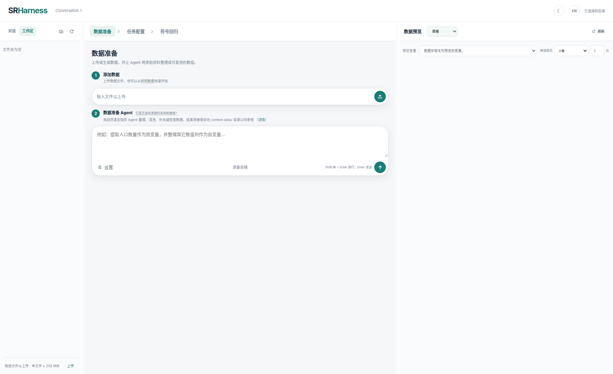
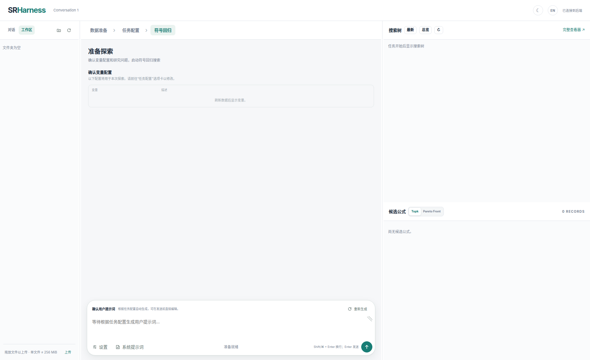

# SRHarness WebUI

WebUI 把一次符号回归研究组织为三个有顺序的阶段：**数据准备 → 任务配置 → 符号回归**。左侧管理对话和工作区，中央完成当前阶段，右侧显示数据预览或搜索结果。

## 启动

```bash
sr-harness run \
  --host 127.0.0.1 \
  --port 11001 \
  --workspace-dir ./workspaces \
  --save-path ./logs/webui
```

浏览器打开 `http://127.0.0.1:11001/`。

## 页面结构



| 区域 | 作用 |
|---|---|
| 顶栏 | 对话名称、语言、暗色模式、连接与运行状态 |
| 左栏 | “对话 / 工作区”切换、创建对话、上传和管理文件 |
| 中央标签 | 数据准备、任务配置、符号回归 |
| 右栏 | 数据准备阶段显示数据/关系预览；其余阶段显示搜索树与候选公式 |

每个对话对应独立的工作区和 `InteractiveSession`。修改对话名称会写回对话注册表；切换对话会切换对应数据、时间线与搜索状态。

## 1. 数据准备

### 导入数据

可以把文件拖入“上传数据”区域，也可以点击上传图标。上传区域右侧的刷新按钮会重新从 `context.data/` 加载数据。

没有数据时可以创建四种内置样例：

1. 二元多项式；
2. 分组参数；
3. 振荡 ODE；
4. 10 节点 BA 网络上的 Kuramoto 动力学。

右栏的数据预览展示变量、形状和样本；“关系预览”可以把变量拖到 X、Y、Hue、Size 槽中检查关系。

### 数据准备 Agent

数据准备 Agent 可以检查上传文件、清洗或补充变量，并把结构化结果写入 `context.data/`。例如：

> 读取 trajectory.csv，用中心差分估计 dx_dt；保留 t 和 x，并在 manifest 中说明变量含义和单位。

Agent 写入后应调用 `validate_context_data`。只有有效数据才由 `InteractiveSession` 重新载入为共享 `AgentContext`。

输入框使用：

- `Enter`：发送；
- `Shift+Enter` 或 `Command+Enter`：换行；
- Agent 工作时第一次点击停止：请求在安全边界暂停；
- 再次点击：中断当前流式输出或工具调用，以更快到达安全边界。

## 2. 任务配置

### 配置变量描述

变量表负责选择因变量、自变量和不使用的变量，并编辑描述。变量描述与 `context.data/manifest.json` 双向同步。描述应说明科学含义、单位和必要约束，但不应泄露待发现的答案。

### 配置问题描述

问题描述会参与生成符号回归的用户提示词，例如：

> Find a compact equation for dx_dt using x and t. Prefer a stable, interpretable model.

文本区域会根据内容增长，也允许手动调整大小。

### 配置评测方案

编辑器下拉栏列出内置 Evaluator 以及 `context.evaluator/` 中的自定义 Evaluator。无法加载的脚本仍会显示，但带有错误标记和具体原因。

- **参数配置**：编辑 `context.args.*`，包括数据切分和排序指标；
- **测试**：用当前最好公式测试 Evaluator；没有候选时使用一个平凡线性公式；
- **保存**：保存编辑后的自定义 Evaluator；
- **评测器构建 Agent**：按自然语言要求创建或修复 Evaluator，默认折叠。

自定义脚本必须定义且只定义一个 `DefaultEvaluator` 子类。它可以相对导入：

```python
from .default_evaluator import DefaultEvaluator
from . import utils
```

Evaluator 的核心入口是 `split`、`fit`、`evaluate`、`fit_candidate` 和 `evaluate_candidate`。后两个入口只作用于正式候选，很适合增加 ODE rollout 等任务特定逻辑。

## 3. 符号回归

进入符号回归页后，先检查：

1. 变量配置；
2. 自动生成、可编辑的用户提示词；
3. 内置默认、可编辑的系统提示词；
4. 模型、搜索参数、工具和 skill。

“重新生成”按钮只在明确点击时重建相应提示词；清空文本不会自动填充。

点击发送按钮启动搜索。用户提示词和系统提示词都会作为卡片出现在时间线中。



### 时间线卡片

除非另有说明，每个后端 Interaction Event 对应一张卡片：

- 系统或用户 prompt 加入 buffer；
- 已发送的模型上下文摘要；
- 模型推理和回复；
- 工具调用与工具结果；
- 状态变化和控制提示。

上下文卡片只显示消息数和字符数。点击链接可进入“当前上下文”查看完整内容。工具返回的 `ToolCallResult.ok` 为 `false` 时，前端使用红色错误图标，但它仍是被统一包装并反馈给 Agent 的正常工具结果。

### 运行中发送消息与暂停

发送按钮随状态变化：

- Agent 空闲且输入非空：上箭头，立即开始或继续；
- Agent 运行且输入非空：上箭头，把消息排到下一个安全边界；
- Agent 运行且输入为空：方块图标，请求暂停；
- 已请求暂停：红色方块，再次点击强制中断当前输出或工具。

普通 assistant 回复没有调用任何工具时，本轮自然结束并等待用户继续；不存在单独的 `ask_human` 状态或工具。

## 搜索树与候选公式

右栏搜索树按 R–C–L 坐标组织节点。候选区可以切换：

- **Top-k**：按 `ranking_metric` 排序；
- **Pareto Front**：默认比较所选指标与复杂度。

点击节点或时间线中的上下文坐标可以查看该次模型请求实际收到的 buffer。Evaluator 新增的数值指标会进入训练/验证 metrics，也可以被选为排序指标。

## 完整案例：从 `(t, x)` 到动力学方程

1. 上传包含 `t`、`x` 的轨迹。
2. 让数据准备 Agent 估计 `dx_dt` 并验证 `context.data`。
3. 在右栏检查三列数据和关系图。
4. 进入任务配置：`dx_dt` 为因变量，`x`、`t` 为自变量。
5. 使用 `DefaultEvaluator` 启动一次搜索，观察逐点导数拟合。
6. 暂停，返回任务配置。
7. 让评测器构建 Agent 创建带 `rollout_rmse` 的 Evaluator，并用“测试”验证。例如：

   > 创建一个继承 DefaultEvaluator 的 TrajectoryRolloutEvaluator。保留默认指标，并在 evaluate_candidate 中积分候选 ODE，增加 rollout_rmse 指标。

8. 把 `ranking_metric` 改为 `rollout_rmse`。
9. 回到符号回归页，告诉 Agent 评测方式已经改变并继续探索。

此时 Current Pareto Front 和 `evaluate_formula` 工具结果都会包含新指标，Agent 可以同时权衡公式复杂度、单步误差和长期轨迹误差。

## 多用户与安全边界

- `--isolate-users` 只按浏览器 Cookie 隔离对话列表；
- `--mount` 的文件对 Agent 只读；
- 普通工作区内容可以被数据准备 Agent 或评测器构建 Agent 修改；
- 模型 API Key、代理和工具能力分别在 Agent 设置中配置；
- 公开部署仍需要外部身份认证和网络访问控制。

CLI 与持久化细节见 [SRHarness](sr-harness.md)。
